# 📚 Rahul Arambepola — Professional Skills Portfolio
### Module: IT1215 | HND in Information Technology | June 2024 Intake
### Campus: SLIIT City Uni | Registration: SA24610322

---

## 🏠 HOME — Academic Journal

### Student Profile

| Detail | Information |
|--------|------------|
| **Name** | Rahul Arambepola |
| **Registration** | SA24610322 |
| **Campus** | SLIIT City Uni |
| **Course** | HND in Information Technology |
| **Intake** | June 2024 |
| **Module** | Professional Skills — IT1215 |
| **Status** | ✅ Verified Student Log |

---

### What is this Portfolio?

This portfolio is a **"Harbor of Sheets"** — a creative, evidence-based scrapbook documenting my learning journey through the Professional Skills module (IT1215).

Rather than a dry document or file directory, this space uses a **scrapbook layout** — polaroids, sticky notes, and sketches — to show that academic growth is an active, iterative, and deeply personal process. Each section captures a week's worth of learning: theory, activities, reflections, and visual mind maps.

---

### The Journey Ahead

| Phase | Weeks | Focus |
|-------|-------|-------|
| 🧭 **Foundation & Self** | Weeks 1–3 | The Harbor concept, Professional Skills, Emotional Intelligence |
| 📄 **Professional Output** | Weeks 4–5 | CV Writing & Research Skills |
| 🤝 **Leadership & Action** | Weeks 6–8 | Agendas, Negotiations & Team Leadership |

**Journal Metrics:** 📅 8 Weeks · 🏛️ 3 Core Pillars · 🎯 1 Academic Journey

---

> 🎨 **Generate this visual with ChatGPT/DALL-E:**
> *"Create a scrapbook-style cover page illustration for an academic portfolio titled 'Harbor of Sheets'. Show a cosy harbor with small boats carrying paper documents, surrounded by sticky notes, polaroid photos, and compass icons. Warm cream background with green and amber accents. Flat, modern illustration style."*

---

---

## 🗺️ WEEK 1: The Harbor

**Session Overview:** An introduction to portfolios — what they are, why they matter, and how to build one.

---

### 🔑 Core Theory: The "Harbor" Concept

A portfolio is literally a **"Harbor of your Sheets"** — a safe, organised place where your work, ideas, and creations are collected, preserved, and displayed for the world to see.

| Etymology | Meaning |
|-----------|---------|
| **Port** (Harbor) | A place to dock and store treasures safely |
| **Folio** (Sheet) | A collection of pages or ideas |

> Just as a harbor protects ships, a portfolio protects and showcases your best work.

---

### Main Functions of a Portfolio

1. **Presenting yourself** — Showcasing your identity, skills, and achievements
2. **Organising history** — Keeping a structured, searchable record of growth over time
3. **Discovering strengths** — Identifying capabilities through curated evidence

---

### Portfolio Formats

| Format | Examples |
|--------|----------|
| 📄 **Hard-copy** | Physical documents, binders, printed folders |
| 💻 **Digital** | Websites, PDFs, cloud drives, social channels |

---

### Industry-Standard Platforms

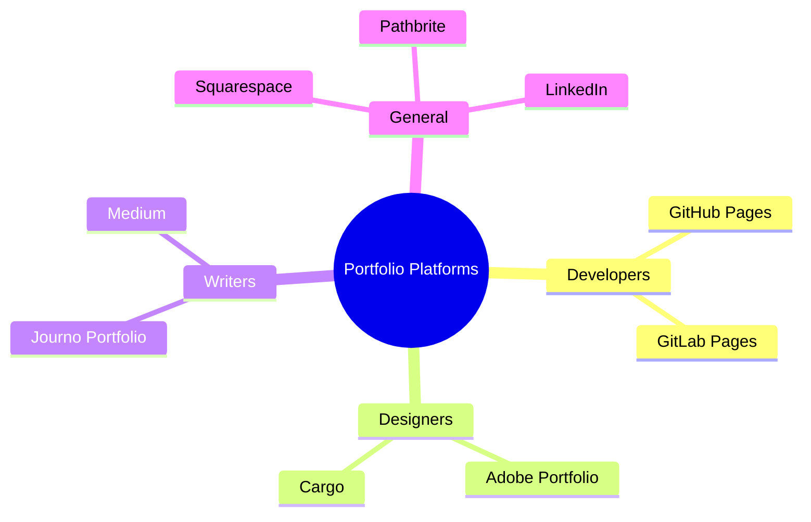

> 🎨 **Generate this visual with ChatGPT/DALL-E:**
> *"Create a colourful, scrapbook-style infographic showing 4 categories of portfolio platforms: Developers (GitHub Pages), Designers (Adobe Portfolio, Cargo), Writers (Journo Portfolio), and General (Squarespace, LinkedIn). Use a sticky note aesthetic on a cream background with green and amber tones. Icons for each platform. Clean and minimal."*

---

### Portfolio Paths: Which One Is Right for You?

| Path | Focus | Examples |
|------|-------|---------|
| **Path A — Personal** | Hobbies & Creative Expression | Photography portfolios, travel blogs, art galleries |
| **Path B — Career** | Employability & Skills | CV, project evidence, technical showcases |

---

### 🤝 Collaborative Activity: Group Portfolio (Task 1)

As a team, we created a collaborative portfolio defining **"Who We Are"**:

1. Defined our team identity — shared backgrounds, goals, and values
2. Mapped out collective technical and soft skills
3. Established shared semester goals

**Outcome:** A unified document demonstrating teamwork, communication, and collective vision.

---

### 🌟 Key Takeaways

1. **The Harbor Mindset** — A portfolio is a continuous, living storage system. Preserving work now ensures readiness for future opportunities.
2. **Platform Selection Matters** — LinkedIn and GitHub are essential for professional visibility in the IT industry.
3. **Collaboration is a Skill** — Merging diverse writing styles and ideas into one unified team voice is itself a professional capability.

---

### ✍️ Personal Reflection

Before this session, I thought a portfolio was just a folder of assignments you hand in at the end of a course. The "Harbor" metaphor changed everything — a portfolio isn't a static submission, it's a *living record of growth*. As someone studying IT, having a GitHub profile for technical projects and a LinkedIn profile for professional presence feels immediately relevant and urgent.

The group portfolio activity also taught me something unexpected: collaborative writing requires compromise, clarity, and a genuine shared vision. That's a skill I'll need in every team I join.

---

### 🚀 Application to Real Life

- **Now:** Creating an organised "Harbor" folder structure for all semester assignments, categorised by week and topic.
- **Future:** Building an evidence-based career portfolio featuring projects from this HND program, ready for internship applications.

---

---

## 💼 WEEK 2: Professional Skills

**Lecturer:** Ms. Oshani
**Session Overview:** Understanding professional skills — their types, components, benefits, and how to develop them for the workplace.

---

### About the Module

Professional skills are the **abilities and qualities** that help a person work effectively and succeed in a professional environment. They encompass both:

- **Technical skills** — programming, writing, research, systems analysis
- **Soft skills** — communication, teamwork, leadership, time management

> Professional skills help individuals perform tasks efficiently, solve problems, work well with others, and achieve career growth.

### Purpose of the Professional Skills Module

This module is designed to help students:

- Develop important workplace and career skills
- Improve communication and teamwork abilities
- Build confidence and professionalism
- Learn how to create CVs, portfolios, and cover letters
- Enhance problem-solving and critical thinking
- Prepare for interviews and job opportunities
- Improve time management and organisational skills
- Support personal and professional development

---

### Three Categories of Workplace Skills

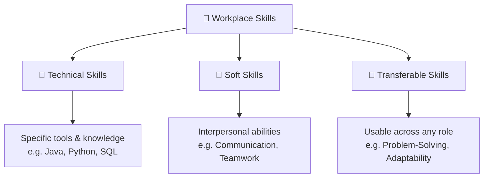

> 🎨 **Generate this visual with ChatGPT/DALL-E:**
> *"Design a clean triangle infographic divided into 3 sections: Technical Skills (tools/knowledge, e.g. Java programming), Soft Skills (interpersonal, e.g. communication, teamwork), and Transferable Skills (usable anywhere, e.g. problem-solving, adaptability). Scrapbook aesthetic, cream background, green and amber accents, flat icons. Label each section with examples."*

---

### Key Components of Professional Skills

| # | Skill | Description |
|---|-------|-------------|
| 1 | 🗣️ **Communication** | Expressing ideas clearly and effectively |
| 2 | 🤝 **Teamwork** | Collaborating with others to achieve common goals |
| 3 | 🌟 **Leadership** | Guiding and motivating team members |
| 4 | 🧩 **Problem-Solving** | Identifying and resolving challenges efficiently |
| 5 | ⏰ **Time Management** | Organising tasks and meeting deadlines |
| 6 | 🔄 **Adaptability** | Adjusting to new situations and technologies |
| 7 | 🧠 **Critical Thinking** | Analysing information to make informed decisions |
| 8 | ⚖️ **Professional Ethics** | Maintaining integrity and responsibility in the workplace |

---

### Benefits of Professional Skills

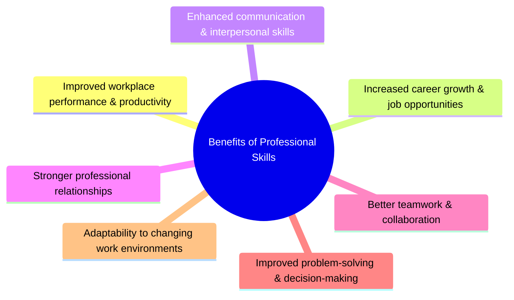

> 🎨 **Generate this visual with ChatGPT/DALL-E:**
> *"Design a radial spoke infographic showing 7 benefits of professional skills branching outward from a central glowing brain icon: Workplace Performance, Career Growth, Communication, Professional Relationships, Teamwork, Problem-Solving, and Adaptability. Modern flat design, cream and green scrapbook aesthetic, each benefit has a small icon."*

---

### How to Improve Professional Skills

- **Continuous learning** — Courses, certifications, online tutorials
- **Practical experience** — Internships, group projects, part-time roles
- **Self-reflection** — Journaling, portfolio building, post-project reviews
- **Seeking feedback** — Peer reviews, mentors, performance conversations
- **Active participation** — Team projects, workshops, leadership opportunities

---

### 🪟 The Johari Window — Self-Awareness Tool

The **Johari Window** is a 2×2 grid that helps you understand yourself through the lens of what *you* know and what *others* know about you.

| | **Known to Self** | **Not Known to Self** |
|---|---|---|
| **Known to Others** | 🟢 **Open Area** — Shared strengths | 🔵 **Blind Area** — Hidden strengths others see in you |
| **Not Known to Others** | 🟡 **Hidden Area** — Things only you know | ⬜ **Unknown Area** — Yet to be discovered |

**Activity:** In class, we passed chits around the room where classmates wrote 3–4 qualities they see in us. By plotting these against our own self-assessment, we discovered our "Blind Area" — strengths we hadn't noticed in ourselves.

> 🎨 **Generate this visual with ChatGPT/DALL-E:**
> *"Create a clean 2x2 Johari Window infographic. Four quadrants: Open Area (green, top-left), Blind Area (blue, top-right), Hidden Area (yellow, bottom-left), Unknown Area (grey, bottom-right). Each quadrant has a brief description. Axes labelled 'Known to Self / Not Known to Self' and 'Known to Others / Not Known to Others'. Scrapbook-style, warm tones, flat design."*

---

### 🎯 Classroom Activities

1. **Skills Match-Up** — Matched a list of job roles (Manager, Sales Rep, Customer Service Agent) to their required skill sets. Showed how each job needs its own unique mix.
2. **Future Goal Writing** — Wrote down the professional skills we'll need for our chosen career path in IT.
3. **Johari Window Exercise** — Used the MyGrow worksheet to map self-known vs peer-observed strengths. The blind-area feedback from classmates was unexpectedly insightful.

---

### 🌟 Key Takeaways

1. Professional skills are just as important as technical skills — employers hire for both.
2. Workplace skills fall into three groups: Technical, Soft, and Transferable.
3. Values, attitudes, and character shape how we behave in professional environments.
4. The Johari Window is a simple but powerful tool for increasing self-awareness.
5. Feedback from others can reveal "blind spots" — strengths we've never noticed ourselves.

---

### ✍️ Personal Reflection

This module gave me a much clearer understanding that being a good IT professional isn't just about coding ability. The skills match-up activity showed how every role — even technical ones — requires a mix of human skills. The Johari Window was the most impactful part: seeing qualities others recognise in you that you've overlooked is a genuinely humbling and motivating experience.

I left the session thinking about how I present myself — not just on paper, but in every group interaction.

---

### 🚀 Application to Real Life

- **Now:** Actively practising time management and communication in group assignments, and building my "Open Area" by sharing more openly with teammates.
- **Future:** Using the Johari Window framework to continuously seek feedback and grow my professional self-awareness throughout my career.

---

---

## 🧠 WEEK 3: Emotional Intelligence

**Lecturer:** Ms. Nilusha Ariasena
**Date:** 03/02/2026
**Session Overview:** Understanding emotions, emotional intelligence, and Goleman's framework for managing emotions professionally.

---

### IQ vs EQ — The Crucial Difference

| | 🧩 IQ (Intelligence Quotient) | 💛 EQ (Emotional Quotient) |
|--|---|---|
| **Definition** | Ability to think, learn, and solve problems logically | Ability to understand and manage your own and others' emotions |
| **Includes** | Logic, math, memory, analytical reasoning | Self-awareness, empathy, emotional regulation, social skills |
| **Helps with** | Academic achievement, technical performance | Leadership, stress management, teamwork, relationships |

> **Key Insight:** IQ gets you *into* a room; EQ determines how far you go once you're there.

---

### What Are Emotions?

Emotions are a complex mix of **feelings, thoughts, physical reactions, and behaviours** triggered by our experiences and environment.

---

### Primary vs Secondary Emotions

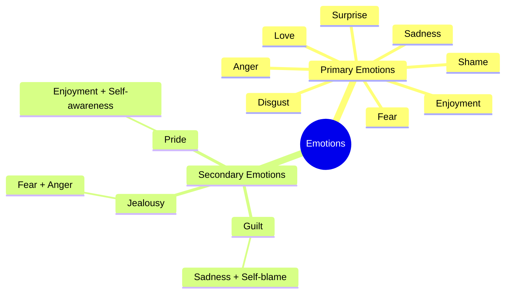

> 🎨 **Generate this visual with ChatGPT/DALL-E:**
> *"Create a colourful emotion wheel infographic showing 8 primary emotions (Love, Enjoyment, Surprise, Fear, Disgust, Sadness, Anger, Shame) in an inner ring, and 3 secondary emotions (Guilt, Jealousy, Pride) in an outer ring showing how they develop from primary emotions. Each emotion has an emoji face. Scrapbook-style, warm cream background, bright flat colours."*

---

### Emotional Leakage

Emotional leakage is when our **true feelings show without us consciously noticing** — through:

- 🗣️ **Voice** — Tone, pitch, speed, trembling
- 😐 **Facial expressions** — Micro-expressions that flash in milliseconds
- 😮 **Breathing** — Shallow, rapid, or held breath
- 🚶 **Body language** — Posture, gestures, eye contact

> Others can often read our emotional state from these signals even when we try to suppress them.

---

### Emotional Intelligence (EI) — The 4 Abilities

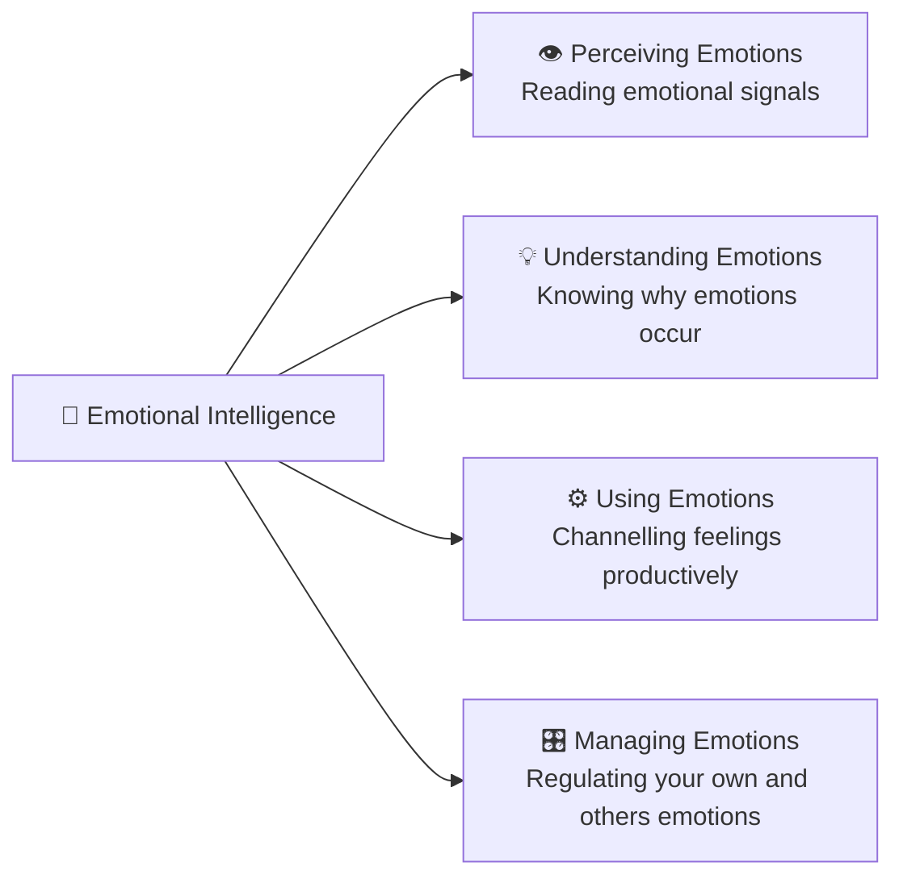

---

### Goleman's 5 Domains of Emotional Intelligence

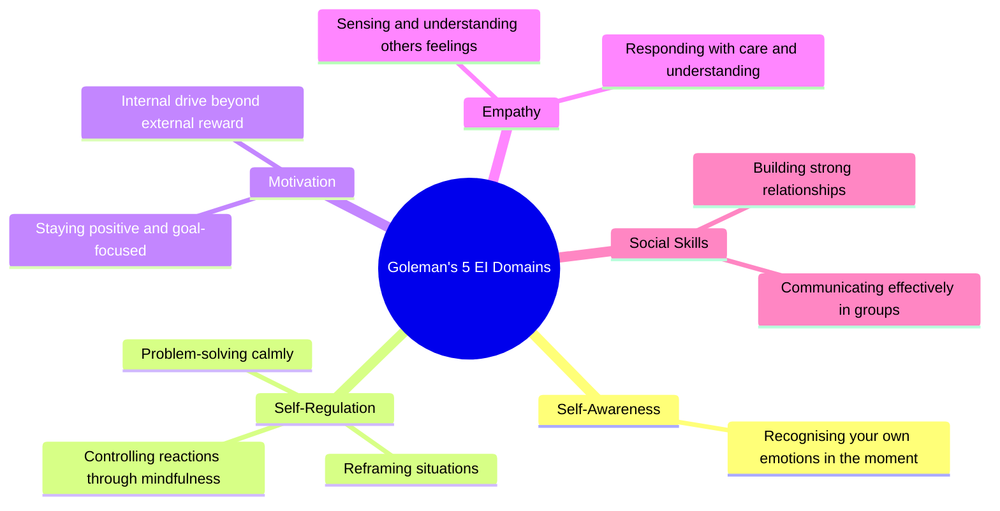

> 🎨 **Generate this visual with ChatGPT/DALL-E:**
> *"Create a pentagon diagram showing Goleman's 5 Domains of Emotional Intelligence. Five equal segments: Self-Awareness, Self-Regulation, Motivation, Empathy, Social Skills. Each segment has an icon and a one-line description. Clean flat design, scrapbook style, soft warm colour palette — cream, green, amber, soft blue."*

---

### Aristotle on Emotional Intelligence (350 BC)

> *"Anyone can become angry — that is easy. But to be angry with the right person, to the right degree, at the right time, for the right purpose, and in the right way — that is not easy."*
> — Aristotle, *The Nicomachean Ethics*

---

### 🎭 Classroom Activities

**Activity 1 — The Surprise Reaction:**
The lecturer suddenly raised her voice at a student. The room went completely silent. She then revealed it was a deliberate demonstration of how **emotions spread instantly and affect an entire room** — this is emotional contagion in action.

**Activity 2 — Emotion Role-Play:**
Each group member was secretly assigned an emotion (Happy, Sad, Angry, Disgusted). Without revealing it, each person behaved according to that emotion in a group conversation.

*My assigned emotion was Happy.* I said "The lecture is almost over!" — my group looked pleased but confused.

The activity showed powerfully how **hidden emotions silently disrupt group dynamics** even when nothing is said directly.

---

### 🌟 Key Takeaways

1. IQ opens doors; EQ keeps them open and earns leadership.
2. Emotions are never truly hidden — they leak through voice, face, and body.
3. Goleman's 5 EI domains: Self-Awareness, Self-Regulation, Motivation, Empathy, Social Skills.
4. Self-regulation means expressing emotions at the *right time*, in the *right way*.
5. Strong EI reduces conflict, builds better relationships, and improves team performance.

---

### ✍️ Personal Reflection

Before this session, I thought emotions were a private matter with no place in professional settings. The role-play activity completely changed that. When one person in a group carries hidden frustration, the entire team feels the tension — even without a single word being spoken.

As an IT student who regularly works in project groups, this lesson is immediately practical. The late-night debugging sessions, the tight deadlines, the disagreements about approach — these are all emotional experiences as much as technical ones. A team that manages emotions well will always outperform one that doesn't, regardless of skill level.

---

### 🚀 Application to Real Life

- **Now:** Before assigning tasks in group projects, checking in on teammates' energy and state of mind rather than diving straight into work.
- **Future:** Using self-regulation during high-pressure moments (tight deadlines, technical failures) to model calm and keep the team focused.

---

---

## 📄 WEEK 4: CV Writing

**Lecturer:** Ms. Anuththara
**Date:** 09/02/2026
**Session Overview:** Crafting a professional CV and cover letter that stands out to employers and passes Applicant Tracking Systems (ATS).

---

### What is a CV?

A CV (Curriculum Vitae) is the **first document that introduces you to a potential employer**. It is your personal marketing document — not simply a record of facts, but a strategically crafted tool designed to get you an interview.

A strong CV must be:

- ✅ Clear, clean, and well-structured
- ✅ Tailored specifically to each job application
- ✅ Error-free (spelling or grammar errors eliminate applications immediately)
- ✅ Keyword-optimised to pass Applicant Tracking Systems (ATS)
- ✅ Packed with achievements, not just duties

---

### Standard CV Structure

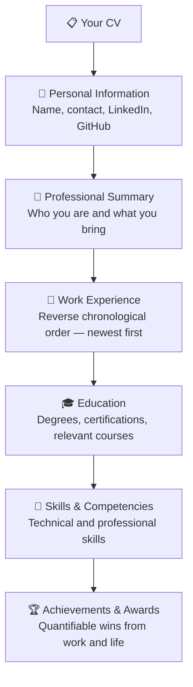

> 🎨 **Generate this visual with ChatGPT/DALL-E:**
> *"Design a vertical flowchart infographic showing the 6-section structure of a professional CV: Personal Information, Professional Summary, Work Experience (reverse chronological), Education, Skills & Competencies, Achievements & Awards. Each section is a card/box with an icon. Clean modern design, cream background with green accents, scrapbook style."*

---

### What to INCLUDE in Your CV

| Element | Why It Matters |
|---------|---------------|
| **Targeted Profile** | Must 'mirror' what the employer says they want — use their own keywords |
| **Strong Personality** | Most CVs feel generic; showing *who you are* makes you memorable |
| **Achievements** | Aim for up to 20 achievements from both work and life experiences |
| **Action Verbs** | "Developed", "Led", "Implemented", "Designed" — active language shows impact |
| **Quantifiable Results** | "Improved loading speed by 40%" beats "improved performance" every time |
| **Relevant Keywords** | Pulled from the job description to pass ATS filters |

---

### What to AVOID in Your CV

| Mistake | Why It's Harmful |
|---------|-----------------|
| **Passive language** | "Responsibilities included..." shows tasks, not success |
| **Unexplained gaps** | Employers draw their own negative conclusions — explain gaps briefly and positively |
| **Irrelevant information** | Date of birth, marital status, short-term unrelated jobs |
| **Spelling or grammar errors** | Can immediately disqualify your application |
| **Generic, untailored content** | A one-size-fits-all CV rarely passes the first review |

---

### Understanding ATS — Applicant Tracking Systems

Most companies use software to filter CVs *before a human ever sees them*:

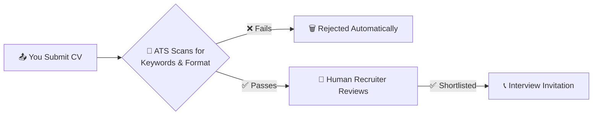

**Tips to pass ATS:**
1. Use exact keywords from the job description
2. Avoid fancy graphics, tables, or icons that ATS can't parse
3. Use standard section headings (Work Experience, Education, Skills)
4. Submit as PDF or Word as specified in the posting

---

### The Cover Letter

A cover letter is a **personalised, 1-page introduction** that accompanies your CV:

| Cover Letter Must... | Why |
|----------------------|-----|
| Show your personality | Differentiates you from identical CVs |
| Explain *why this company* | Proves genuine research and motivation |
| Match your skills to their needs | Shows you've read the job description carefully |
| Be concise | Recruiters skim — every word must earn its place |

---

### LinkedIn as a Living CV

> Your LinkedIn profile is your CV that *works for you while you sleep.*

- Employers regularly check LinkedIn before calling for interviews
- Should reflect and expand your CV, not contradict it
- Recommendations and endorsements add third-party credibility
- Shows professional activity: posts, articles, and engagement

---

### 🌟 Key Takeaways

1. A CV is a marketing document — not just a fact list. Tailor it every time.
2. Research the company and use job-description keywords to pass ATS.
3. A cover letter explains *why you're the right fit*, not just what you've done.
4. LinkedIn is an important extension of your CV and should be kept professional.
5. Action verbs and quantifiable achievements make a CV stand out.
6. Common mistakes — spelling errors, irrelevant info — can instantly eliminate applications.

---

### ✍️ Personal Reflection

Before this session, I thought writing a CV was simply listing qualifications and hoping for the best. Learning about ATS systems was genuinely eye-opening — your CV might never be seen by a human if it's not keyword-optimised. The cover letter exercise also showed how small changes (an action verb here, a specific achievement there) transform a generic document into something that actually commands attention.

As I work toward my first IT internship, I now understand that my GitHub repositories and LinkedIn profile need to tell a consistent, professional story — one that connects my academic work to real-world value.

---

### 🚀 Application to Real Life

- **Now:** Updating my CV and LinkedIn profile to reflect my current skills, projects, and academic achievements.
- **Future:** Tailoring every application separately — matching my skills to each job description and writing a bespoke cover letter each time.
- **Long-term:** Maintaining a "running achievements list" throughout my career so I always have strong, quantifiable content ready.

---

---

## 🔬 WEEK 5: Research

**Lecturer:** Dr. Janaka Alawathugoda
**Date:** 17/02/2026
**Session Overview:** Understanding the importance of research skills in both academic study and professional IT practice.

---

### Why Research Matters

Research is not just for academics — it is a **practical professional skill** used daily in IT:

- Developing **new ideas** and improving existing systems
- Making **evidence-based decisions** rather than assumptions
- Building **better applications** by learning from what already exists
- Supporting your **top-up degree** and postgraduate study
- Solving **real-world problems** with structured, repeatable approaches

> Research helps us move from *guessing* to *knowing with evidence.*

---

### Types of Research

| Type | Description | IT Example |
|------|-------------|-----------|
| **Primary** | Collecting original data directly | Surveys of app users, usability testing |
| **Secondary** | Using existing published material | Literature reviews, reading technical papers |
| **Qualitative** | Exploring opinions and experiences | Interviews about user experience |
| **Quantitative** | Measuring and analysing numerical data | Load testing, performance benchmarks |

---

### Standard Research Paper Structure

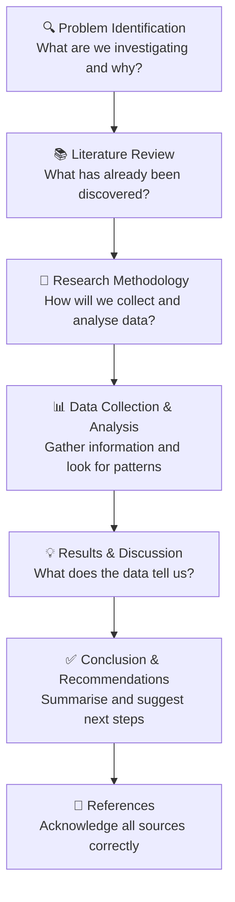

> 🎨 **Generate this visual with ChatGPT/DALL-E:**
> *"Create a vertical flowchart infographic showing the 7 steps of academic research: Problem Identification, Literature Review, Research Methodology, Data Collection & Analysis, Results & Discussion, Conclusion & Recommendations, References. Each step is a rounded box with an icon and a brief description. Clean modern scrapbook design, warm cream and amber tones."*

---

### Step-by-Step Research Process

| Step | Action | Purpose |
|------|--------|---------|
| **1** | Identify the Problem | Define precisely what you're investigating and why it matters |
| **2** | Literature Review | Learn what researchers and practitioners have already discovered |
| **3** | Choose Methodology | Decide *how* you'll gather and analyse data |
| **4** | Collect Data | Implement your data collection method rigorously |
| **5** | Analyse Data | Look for patterns, trends, correlations, and anomalies |
| **6** | Results & Discussion | Interpret the data — what does it actually mean? |
| **7** | Conclusion | Summarise findings, acknowledge limitations, suggest future research |

---

### Research Applied to IT

Research methods apply directly to real IT work:

| IT Scenario | Research Application |
|-------------|---------------------|
| Building a mobile app | Research existing similar apps before designing yours |
| Improving database performance | Benchmark current performance, review optimisation literature |
| Choosing a tech stack | Compare frameworks using evidence, not trends |
| Designing a UI | Conduct user research to inform design decisions |

---

### Academic Honesty

Good research is built on integrity:

- **Proper referencing** — Acknowledge *every* source used
- **No plagiarism** — Always paraphrase, cite, and credit
- **Transparency** — Describe methods clearly so others can verify findings
- **Accurate reporting** — Report results honestly, even when unexpected

---

### 🌟 Key Takeaways

1. Research is a core skill for top-up degrees and real-world IT development.
2. Every research paper follows a standard structure that makes findings logical and credible.
3. Starting with a clear problem statement is the single most important foundation.
4. Methodology must be described accurately so others can understand and replicate work.
5. Research writing requires clear language, proper referencing, and academic honesty.

---

### ✍️ Personal Reflection

Before this session, I assumed research was only for professors or final-year dissertations. Dr. Janaka's connection between research and building real applications made the topic immediately relevant. The step-by-step structure makes research feel less like an overwhelming academic task and more like structured problem-solving — something we do every time we approach a programming challenge.

This session changed how I approach my assignments. Now I identify the problem first and review what's already been said before jumping into writing or coding.

---

### 🚀 Application to Real Life

- **Now:** Applying the research structure to university assignments — problem first, literature second, then analysis.
- **Future:** Before starting any project, doing a short literature/market review to understand what's already been built.
- **Long-term:** Using research methods in my IT career to develop evidence-based solutions and write credible technical reports.

---

---

## 📋 WEEK 6: Writing Agendas & Meetings

**Lecturer:** Ms. Sathsarani Samarakoon
**Date:** 24/03/2026
**Session Overview:** Learning to write professional agendas and conduct effective, structured meetings.

---

### What is an Agenda?

An agenda is a **structured outline of topics, activities, and sessions** for any meeting or event. It is a *strategic tool* — not just a to-do list — that:

- Keeps everyone focused and on track
- Manages time and sets clear expectations
- Ensures the desired outcomes are actually achieved
- Provides a formal record of what was intended to be discussed

---

### Types of Agendas

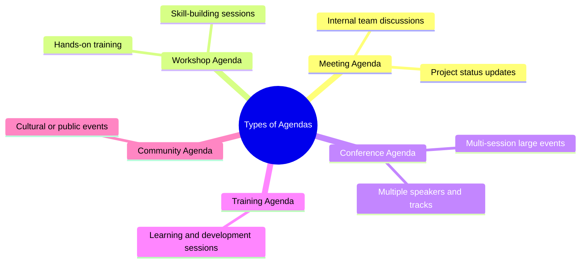

---

### Components of a Well-Written Agenda

| Component | Purpose |
|-----------|---------|
| **Event Details** | Meeting name, date, venue, start/end time |
| **Welcome & Opening** | Sets the professional tone |
| **Confirmation of Previous Minutes** | Formal opening item for recurring meetings |
| **Session List** | Numbered topics with time allocations and facilitators |
| **Breaks** | Maintains focus and energy across long sessions |
| **Interactive Activities** | Keeps participants engaged |
| **Closing Remarks** | Summarise decisions and confirm next steps |
| **Any Other Matter (with Chair's permission)** | Standard formal closing item |

---

### Types of Meetings

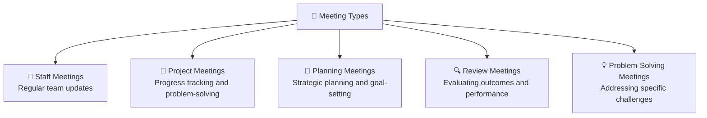

> 🎨 **Generate this visual with ChatGPT/DALL-E:**
> *"Create a radial mind map infographic showing 'Types of Meetings' with 5 branches: Staff Meetings, Project Meetings, Planning Meetings, Review Meetings, Problem-Solving Meetings. Each branch has an icon and a brief description. Clean modern scrapbook design, cream and green tones, flat illustration style."*

---

### The 5-Step Meeting Structure

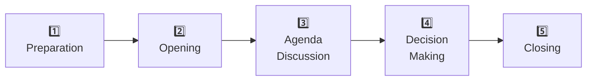

| Step | Key Actions |
|------|------------|
| **1. Preparation** | Circulate agenda in advance; gather materials; confirm roles |
| **2. Opening** | Welcome attendees; confirm minutes from last meeting |
| **3. Agenda Discussion** | Work through each numbered item systematically |
| **4. Decision-Making** | Reach conclusions; assign action items with clear owners and deadlines |
| **5. Closing** | Summarise all decisions; confirm next meeting date and responsibilities |

---

### Key Roles in a Meeting

| Role | Core Responsibilities |
|------|-----------------------|
| **Chairperson** | Guides discussion, manages time, ensures all voices are heard, remains neutral |
| **Secretary / Minute-Taker** | Records discussions, decisions, and action items accurately |
| **Participants** | Prepare in advance, contribute ideas, stay on topic, respect others |

### Meeting Etiquette

- ⏰ **Punctuality** — Arrive prepared and on time
- 📋 **Preparation** — Read the agenda before attending
- 🗣️ **Clarity** — Speak clearly and concisely
- 🤫 **Active listening** — Don't interrupt; wait your turn
- 📵 **No distractions** — Phones and laptops away unless required

---

### 🎯 Activity: Mock Meeting — Startup Café Project

We performed a full mock meeting in the **7th-floor board meeting room** using the Startup Café business scenario. I was selected as **Chairperson (CEO)**:

| Role | Person |
|------|--------|
| 🪑 **Chairperson (CEO)** | **Rahul Arambepola** |
| 📝 Secretary | Avinash |
| 💰 Finance Analyst | Madushan |
| 📣 Marketing Analyst | Sangeeth |
| ⚙️ Operations Head | Sahan |
| 👥 HR Coordinator | Methmal |

Following the complete 5-step structure in a real boardroom setting was an experience unlike anything in a typical classroom.

---

### 🌟 Key Takeaways

1. An agenda is a *strategic* tool — the difference between a productive meeting and a wasted hour.
2. Every agenda needs the standard formal format with all essential components.
3. Meetings follow a clear 5-step structure: Prepare → Open → Discuss → Decide → Close.
4. The Chairperson and Secretary are the most critical roles for a smooth meeting.
5. Meeting etiquette — punctuality, preparation, listening — is just as important as the agenda.
6. Mock meetings build genuine confidence for real professional environments.

---

### ✍️ Personal Reflection

Before this session, I assumed running a meeting was simply gathering people and talking through issues until something was decided. Leading the Startup Café meeting as Chairperson completely revised that assumption. Having a structured agenda meant I could redirect off-topic conversations and ensure every role contributed.

Sitting in a formal boardroom and following professional protocols made the experience feel surprisingly real. That environment — the table, the roles, the formal language — changed how I carried myself. I felt more confident, more deliberate, and more professional.

---

### 🚀 Application to Real Life

- **Now:** Using the proper agenda format for all group project meetings — with time slots, facilitators, and clear action items.
- **Future:** Applying the 5-step structure whenever leading or participating in professional team discussions.
- **Long-term:** These skills will serve me in every client meeting, sprint planning session, and stakeholder presentation throughout my IT career.

---

---

## 🤝 WEEK 7: Types of Negotiations

**Lecturer:** Ms. Lelani Kandegamage
**Date:** 24/03/2026
**Session Overview:** Negotiation as a core professional skill — strategies, tactics, frameworks, and the win-win mindset.

---

### What is Negotiation?

Negotiation is far more than arguing for what you want. It is a **key life skill** applied daily in professional contexts:

- 💼 Job offers and salary discussions
- 🗓️ Project scope, timelines, and deadlines
- 👥 Task allocation within teams
- 🤝 Client and stakeholder relationship management
- 🏢 Everyday workplace decisions and compromises

> **Preparation is the single most important factor in every negotiation.**

---

### Gavin Kennedy's 3 Negotiation Behaviours

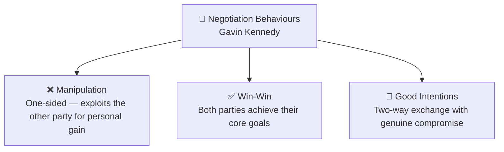

---

### The 5-Step Negotiation Process

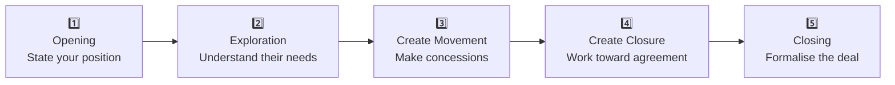

| Step | What Happens |
|------|-------------|
| **1. Opening** | State your position, goals, and expectations clearly |
| **2. Exploration** | Listen actively to understand the other party's needs and priorities |
| **3. Create Movement** | Make strategic concessions; identify shared ground |
| **4. Create Closure** | Drive toward a mutually acceptable agreement |
| **5. Closing** | Formalise the agreement; confirm all parties understand commitments |

---

### Common Negotiation Tactics — Know Them to Beat Them

| Tactic | How It Works |
|--------|-------------|
| **High Ball** | Open with an inflated demand to anchor expectations high |
| **Low Ball** | Start very low to make later offers seem more reasonable |
| **Big Fish** | Claim authority of a larger party to add pressure |
| **Bluff** | Pretend to have more leverage or information than you do |
| **Bad Cop / Good Cop** | One negotiator is aggressive; the other is friendly and reasonable |
| **Delays** | Use time pressure ("I need an answer today") as leverage |
| **No Authority** | Claim you need to consult a higher authority before agreeing |
| **Change the Negotiator** | Swap your negotiator mid-process to reset expectations |

---

### Key Negotiation Concepts

| Concept | Definition |
|---------|-----------|
| **BATNA** | *Best Alternative To a Negotiated Agreement* — your strongest backup plan if talks fail |
| **ZOPA** | *Zone Of Possible Agreement* — the range where both parties can reach a deal |
| **Me First (Win/Lose)** | One party gains significantly at the other's expense |
| **We First (Win/Win)** | Both parties achieve their core goals; relationship is preserved |

---

### Me First vs We First

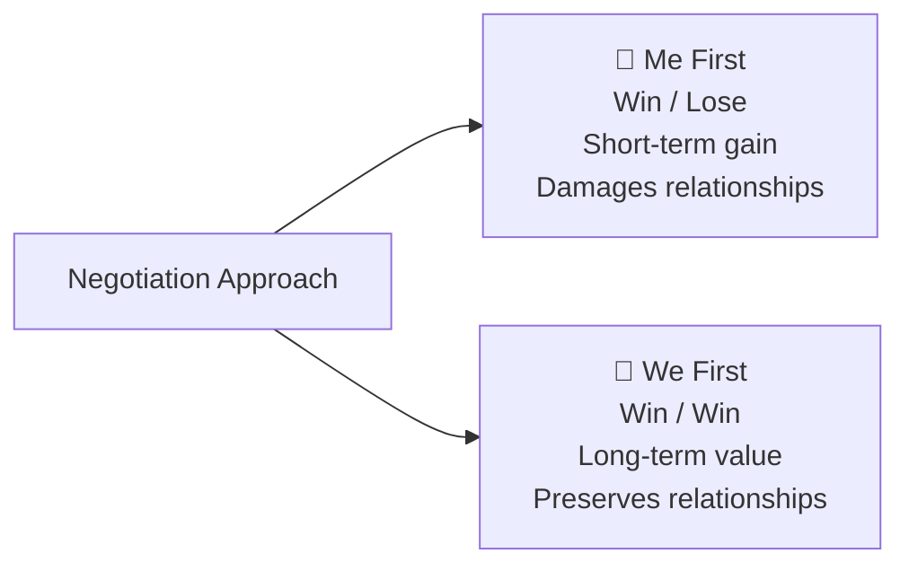

> In professional life, **We First (Win/Win)** almost always produces better long-term outcomes. You work with the same people again — burning bridges is never worth it.

---

### Top 10 Effective Negotiation Skills

1. 🧩 Problem Analysis
2. 👂 Active Listening
3. 🗣️ Verbal Communication
4. 🎯 Decision Making
5. ⚖️ Ethical Behaviour
6. 📋 Preparation
7. 💡 Problem Solving
8. 🧘 Emotional Control
9. 🤝 Collaborative Approach
10. 🌐 Interpersonal Skills

> 🎨 **Generate this visual with ChatGPT/DALL-E:**
> *"Create an infographic showing the 5-step negotiation process as a rising staircase: Opening, Exploration, Create Movement, Create Closure, Closing. Each step has a brief description and icon. Below, add two small side-by-side cards: BATNA (Best Alternative To a Negotiated Agreement) and ZOPA (Zone Of Possible Agreement) with brief definitions. Scrapbook style, cream and green colour scheme."*

---

### 🌟 Key Takeaways

1. Preparation is the foundation of every successful negotiation.
2. Three negotiation behaviours exist: Manipulation, Win-Win, and Good Intentions.
3. The 5-step process: Opening → Exploration → Movement → Closure → Closing.
4. Knowing common tactics helps you recognise them and respond strategically.
5. BATNA and ZOPA are the two most critical concepts before entering any negotiation.
6. Win-Win (We First) is more effective than Win-Lose (Me First) in professional relationships.

---

### ✍️ Personal Reflection

Before this session, I assumed negotiation was reserved for high-stakes business deals or buying a car. The lecture revealed that I negotiate every single day — when dividing up group project tasks, when discussing deadline extensions with lecturers, when deciding whose design approach the team follows.

The 5-step framework gave me language for something I was doing intuitively but inconsistently. I found myself most drawn to the Win-Win philosophy — it reflects the kind of collaborator I aspire to be. In IT, where you work with the same people across multiple projects and years, maintaining relationships is just as valuable as winning a single argument.

---

### 🚀 Application to Real Life

- **Now:** Using the 5-step structure in group project discussions; always preparing my BATNA before negotiating deadlines.
- **Future:** Applying active listening and win-win thinking in all client and team negotiations during my IT career.
- **Long-term:** Salary negotiations, project scoping, vendor agreements — these skills will matter at every career stage.

---

---

## 👥 WEEK 8: Team Leadership Skills

**Lecturer:** Mr. Suresh Dissanayake
**Date:** 31/03/2026
**Session Overview:** Understanding the dynamics of effective teamwork, leadership models, conflict management, and practical team collaboration.

---

### Why Teamwork Matters

> *"Everyone needs somebody, anybody… a reason to live."*
> — Mr. Suresh Dissanayake

Real strength and purpose in professional life come from working *with* others — not despite them.

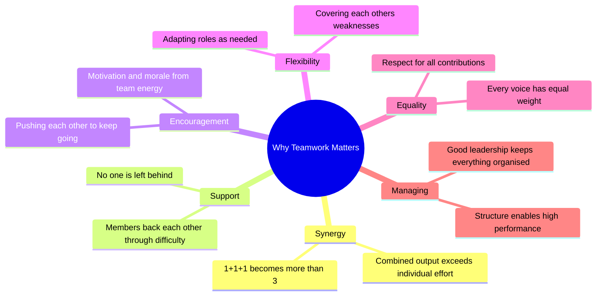

> 🎨 **Generate this visual with ChatGPT/DALL-E:**
> *"Design a radial spoke infographic titled 'Why Teamwork Matters'. Six spokes extend outward from a central circle: Synergy, Support, Encouragement, Flexibility, Equality, and Managing. Each spoke has a brief description and a small icon. Clean modern flat design, scrapbook aesthetic, warm cream background with green and blue tones."*

---

### Characteristics of Effective Teams

- 🗣️ Clear and open communication
- 🌟 Recognition of individual talent and contribution
- 🏡 A genuine sense of belonging and psychological safety
- 🎯 Clear leadership with defined direction
- 📐 Structured roles and responsibilities
- ✅ Achievable, clearly communicated goals
- 🔄 Regular, constructive feedback loops
- 💡 Always solution-focused — not problem-obsessed

---

### Tuckman's 5 Stages of Group Development

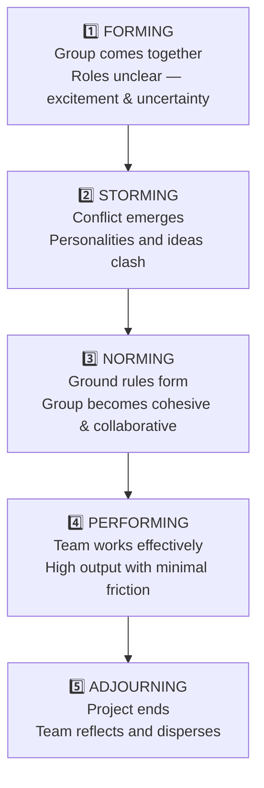

| Stage | What's Happening | Leadership Response |
|-------|-----------------|---------------------|
| **Forming** | Excitement + uncertainty; testing boundaries | Provide clear direction and structure |
| **Storming** | Conflict; personality clashes; power struggles | Facilitate discussion; normalise disagreement |
| **Norming** | Cohesion forms; rules emerge; trust builds | Encourage collaboration; step back slightly |
| **Performing** | High-functioning; shared goals; low friction | Support; celebrate wins; remove blockers |
| **Adjourning** | Completion; reflection; transition | Acknowledge contributions; capture learnings |

> **Key insight:** Every team goes through *all 5 stages* — even conflict during Storming is not a failure. It is a necessary step toward high performance.

---

### Kenneth Thomas Conflict Management Model (1971)

Thomas maps conflict styles against **how important the goal is to you** and **how important the relationship is to you**:

| Animal | Style | Goal | Relationship | Best Used When |
|--------|-------|------|-------------|---------------|
| 🦈 **Shark** | Competing | High | Low | Emergency decisions with no time to consult |
| 🦉 **Owl** | Collaborating | High | High | Long-term partnerships where both sides matter |
| 🦊 **Fox** | Compromising | Medium | Medium | Practical short-term solutions needed quickly |
| 🐢 **Turtle** | Avoiding | Low | Low | Issue is trivial or timing is wrong |
| 🧸 **Teddy Bear** | Accommodating | Low | High | Preserving a relationship matters more than the outcome |

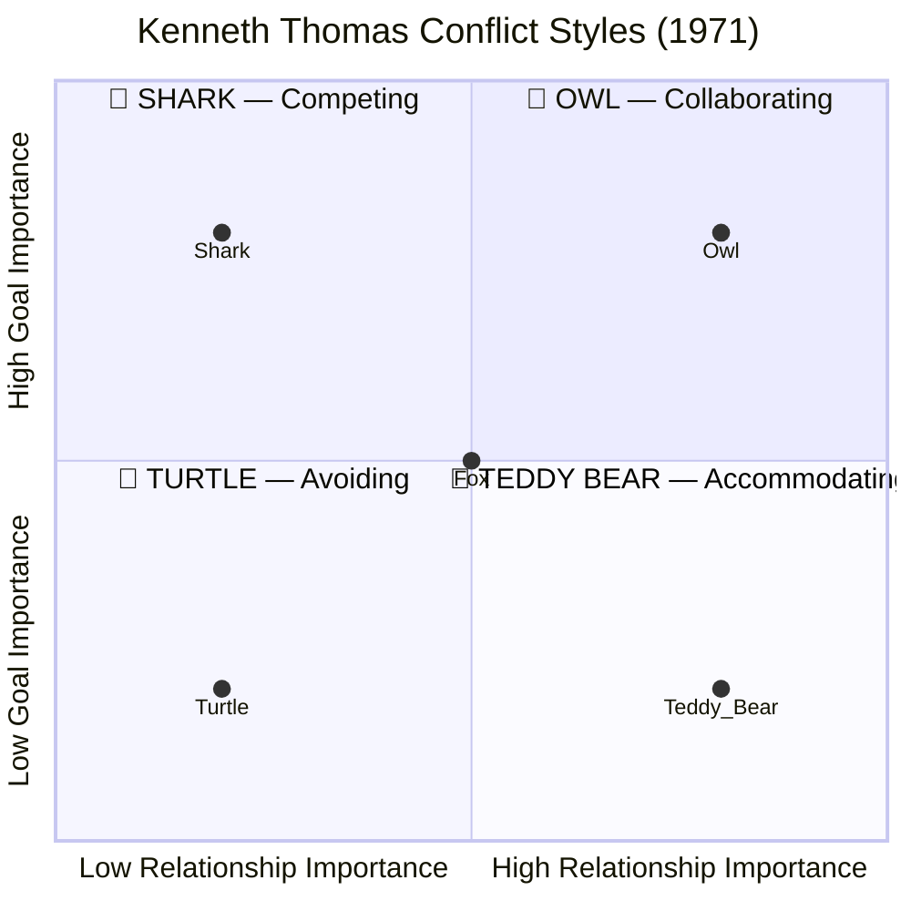

> 🎨 **Generate this visual with ChatGPT/DALL-E:**
> *"Create a 2x2 matrix infographic of Kenneth Thomas's 1971 Conflict Management Model. X-axis: 'Relationship Importance' (low to high). Y-axis: 'Goal Importance' (low to high). Four quadrants: Shark/Competing (top-left, orange), Owl/Collaborating (top-right, green), Turtle/Avoiding (bottom-left, grey), Teddy Bear/Accommodating (bottom-right, blue). Centre: Fox/Compromising (pink). Each cell has the animal emoji and style name. Clean 2x2 grid design, modern flat style, cream background."*

---

### 🏗️ Activity: A4 Paper Tower Challenge

Divided into 4 groups, each team received only **2 sheets of A4 paper and 10 minutes** to build the **tallest free-standing tower** — no other materials.

> 🏆 **Result: Our group built the HIGHEST tower in the class!**

What the activity revealed:
- **Synergy** — Our combined approach produced something none of us would have built alone
- **Communication** — Fast, clear decisions under time pressure were decisive
- **Leadership** — Someone had to commit to a design quickly and rally the team
- **Problem-Solving** — Adapting mid-build when our first structure started to lean
- **Flexibility** — Each person contributed different folding and structural ideas

> A rival team's tower collapsed at the very last second — showing how poor communication, unclear leadership, and weak coordination can destroy even a strong idea under pressure. That moment taught more than any success could.

---

### Movie Clips Used in Class

Mr. Suresh used short film clips to illustrate leadership concepts:

| Clip | Lesson |
|------|--------|
| **The Avengers — Chitauri Battle** | People from completely different backgrounds uniting for a single shared goal |
| **Lord of the Rings — Forming the Fellowship** | The Forming and Norming stages; different skills converging around one mission |
| **The Last Ship** | Leadership under extreme pressure; maintaining team cohesion in crisis |

---

### 🌟 Key Takeaways

1. Effective teamwork requires synergy, support, equality, and clear leadership — not just technical skill.
2. Every team naturally goes through Tuckman's 5 stages — Storming is normal, not a sign of failure.
3. Understanding your conflict style (Thomas model) helps you manage disagreements strategically.
4. Being a great team leader means understanding people and creating belonging — not just giving instructions.
5. Practical challenges (like the tower activity) reveal more about team dynamics than theory alone.

---

### ✍️ Personal Reflection

This session brought together everything we'd covered across the entire module. The tower-building activity was the highlight — not because we won, but because I could *see* every concept playing out in real time. We formed, stormed briefly over design disagreements, normed around a shared approach, performed under pressure, and adjourned with pride.

Mr. Suresh's opening quote stayed with me. In IT, where projects are increasingly complex and distributed, knowing how to build and lead effective teams isn't optional — it's the foundation everything else rests on.

The Kenneth Thomas model helped me identify my own default conflict style. I lean toward Owl (Collaborating) — I want solutions that genuinely work for everyone, even when that takes more time. That self-knowledge is something I'll carry into every team I join.

---

### 🚀 Application to Real Life

- **Now:** Using Tuckman's stages to diagnose where our group projects are — especially recognising Storming as a normal, temporary phase, not a crisis.
- **Future:** Focusing on clear communication and regular team feedback in all collaborative work.
- **Long-term:** Embracing diversity in teams; developing leadership that creates genuine belonging and drives high performance.

---

---

## 📖 OVERALL REFLECTION

Through the Professional Skills module (IT1215), I've built a foundation of competencies that extend far beyond technical IT knowledge. Each session added a new layer:

| Week | Topic | What It Changed in Me |
|------|-------|-----------------------|
| 1 | The Harbor | Shifted from passive assignment holder to active portfolio builder |
| 2 | Professional Skills | Understood that technical excellence needs professional character to succeed |
| 3 | Emotional Intelligence | Realised emotions are a team dynamic, not a private matter |
| 4 | CV Writing | Learned to present myself strategically, not just factually |
| 5 | Research | Developed a structured, evidence-first approach to problem-solving |
| 6 | Agendas & Meetings | Built real confidence in leading and participating in formal settings |
| 7 | Negotiations | Discovered that every conversation is an opportunity for mutual value |
| 8 | Team Leadership | Proved that the best outcomes emerge from genuine collaboration |

The hands-on activities — the mock boardroom meeting, the paper tower challenge, the Johari Window exercise, the emotion role-play — made abstract concepts tangible. I don't just *know* these things; I've actually *practised* them.

> *"Professional skills are the operating system on which technical skills run. Without the OS, the best code in the world sits idle."*
> — Rahul Arambepola

---

*Portfolio by Rahul Arambepola · SA24610322 · SLIIT City Uni · HND in Information Technology · June 2024 Intake · Module IT1215*

---

---

## 🎨 COMPLETE CHATGPT/DALL-E VISUAL PROMPTS — QUICK REFERENCE

| Week | Visual | Prompt Summary |
|------|--------|---------------|
| Home | Cover illustration | Scrapbook harbor with paper boats, sticky notes, compass icons, cream + green |
| Week 1 | Platform mind map | Colourful sticky-note infographic of portfolio platforms by profession type |
| Week 2 | Skills triangle | Three-section triangle: Technical, Soft, Transferable skills with IT examples |
| Week 2 | Benefits wheel | Radial spoke diagram with 7 professional skill benefits, brain icon centre |
| Week 2 | Johari Window | Clean 2×2 grid, 4 coloured quadrants with descriptions, flat design |
| Week 3 | Emotion wheel | Inner ring: 8 primary emotions with emoji; outer ring: secondary emotions |
| Week 3 | Goleman pentagon | Five equal segments for 5 EI domains, icons + descriptions, soft colours |
| Week 4 | CV structure flowchart | Vertical 6-section flowchart of CV structure, green and cream accents |
| Week 5 | Research process | 7-step vertical flowchart with icons, warm amber and cream tones |
| Week 6 | Meeting types mind map | Radial map with 5 meeting types, icons and brief descriptions |
| Week 7 | Negotiation staircase | 5-step rising staircase + BATNA/ZOPA side cards, green scheme |
| Week 8 | Teamwork spokes | 6-spoke radial infographic of why teamwork matters |
| Week 8 | Thomas conflict matrix | 2×2 grid with animal emojis (Shark, Owl, Turtle, Teddy Bear, Fox) |

---

## 🔗 REFERENCES

- Goleman, D. (1995). *Emotional Intelligence*. Bantam Books.
- Salovey, P., & Mayer, J. D. (1990). Emotional Intelligence. *Imagination, Cognition and Personality*.
- Tuckman, B. (1965). Developmental Sequence in Small Groups. *Psychological Bulletin, 63*(6), 384–399.
- Thomas, K. W. (1971). *Conflict and Conflict Management*. Handbook of Industrial & Organizational Psychology.
- Kennedy, G. (1998). *The New Negotiating Edge*. Nicholas Brealey Publishing.
- Aristotle (350 BC). *The Nicomachean Ethics*.
- Peterson, C., & Seligman, M. E. P. (2004). *Character Strengths and Virtues*. Oxford University Press.
- University of Wisconsin–Eau Claire Career Services Guide.
