# 🎨 Visual Generation Guide - IT1215 Portfolio
### Rahul Arambepola · SA24610322 · SLIIT City Uni

---

## Overview

| Category | Count | Tool |
|----------|-------|------|
| **DALL-E / ChatGPT Image Prompts** | 13 | ChatGPT (GPT-4o image gen) or DALL-E 3 |
| **Mermaid Diagram Code Blocks** | 18 | GitHub, Notion, Obsidian, or any Mermaid renderer |
| **Total Visuals** | **31** | - |

> **Global aesthetic for all DALL-E images:**
> Flat vector illustration · Scrapbook editorial style · No photorealism · No 3D rendering
>
> **Global color palette:**
> - Cream background `#FDF6EC`
> - Forest green `#2D6A4F`
> - Amber `#E76F51`
> - Teal `#457B9D`
> - Warm off-white `#FAFAFA`
> - Charcoal text `#2B2B2B`

---

---

# PART 1 - IMAGE GENERATION PROMPTS (DALL-E / ChatGPT)

---

## 🏠 HOME - 01 · Harbor Cover Illustration

| Property | Value |
|----------|-------|
| **Week** | Home / Landing Page |
| **Placement** | Hero banner, top of portfolio |
| **Aspect Ratio** | `16:9` landscape |
| **Suggested Size** | 1920 × 1080 px |

### Prompt

```
Digital flat illustration, top-down isometric view of a peaceful harbor at soft golden hour. Several small wooden boats and sailboats float on calm turquoise-teal water, each carrying neatly stacked paper documents, open notebooks, and folded pages. The harbor shoreline has wooden piers and dock cleats. 

Scattered around the composition: hand-drawn yellow sticky notes with short handwritten labels like "Skills", "Growth", "Evidence", Polaroid photo frames containing sketched icons (compass, lightbulb, pencil), a compass rose symbol, paper airplanes mid-flight, ruler sketches, and small hand-drawn stars.

Title text "Harbor of Sheets" in a clean hand-lettered serif font, centered at the top of the composition. Subtitle "Professional Skills Portfolio · IT1215 · Rahul Arambepola" in smaller weight directly below.

Color palette: warm cream sky (#FDF6EC), forest green water tones (#2D6A4F), amber boat accents (#E76F51), teal water (#457B9D), light sand docks (#F4E9D0), warm white paper (#FAFAFA). Black thin linework throughout.

Style: clean flat vector illustration, subtle hand-drawn paper textures, consistent stroke weight 2px, soft flat drop shadows only, modern editorial scrapbook aesthetic. No photorealism. No 3D rendering. No heavy gradients except a soft cream-to-pale-amber sky wash.

Aspect ratio 16:9, high resolution, print-ready, white margins.
```

### Notes
- This is the hero visual; it should feel warm and welcoming, not academic or corporate.
- The boats should look like they're "docking" precious documents - reinforce the Harbor metaphor.
- If the text generation looks messy, remove title text from prompt and overlay it manually in Canva or Figma.

---

## 🗺️ WEEK 1 - 02 · Portfolio Platforms Infographic

| Property | Value |
|----------|-------|
| **Week** | Week 1 - The Harbor |
| **Placement** | After "Industry-Standard Platforms" heading |
| **Aspect Ratio** | `4:3` landscape |
| **Suggested Size** | 1200 × 900 px |

### Prompt

```
Clean infographic illustration in a sticky-note scrapbook aesthetic. A warm cream cork-board background (#D4A96A light texture) with four large sticky notes pinned in a 2×2 grid layout. Each sticky note has a subtle top-corner tape or pin detail and a soft drop shadow.

Top-left sticky note (sage green #C8E6C9): Title "🖥️ Developers" in bold handwritten font. Lists below: "GitHub Pages" and "GitLab Pages". Small GitHub Octocat-style or terminal bracket icon in top-right corner of the note.

Top-right sticky note (warm amber #FFCC80): Title "🎨 Designers" in bold handwritten font. Lists below: "Adobe Portfolio" and "Cargo". Small paint palette icon in top-right corner.

Bottom-left sticky note (sky blue #B3D9F7): Title "✍️ Writers" in bold handwritten font. Lists below: "Journo Portfolio" and "Medium". Small quill pen icon in top-right corner.

Bottom-right sticky note (pale yellow #FFF59D): Title "🌐 General" in bold handwritten font. Lists: "Squarespace", "LinkedIn", "Pathbrite". Small globe icon in top-right corner.

Center connector: small decorative compass rose design at the exact center where the four notes almost touch.

Overall title at top above the grid: "Portfolio Platforms by Profession" in bold serif font, dark charcoal, like a handwritten board header.

Color palette: cork-board texture background, four distinct pastel sticky note colours as above, black handwritten-style text on each note. Items as a simple bulleted list on each note using a small dash "–".

Style: flat editorial vector, warm and approachable, scrapbook pinboard aesthetic. No photorealism. No gradients on sticky notes.
Aspect ratio 4:3. High resolution.
```

### Notes
- The four quadrant layout mirrors the portfolio categories naturally - reinforce the grouping visually.
- If icons are rendered poorly by AI, remove the icon instruction and place emoji manually.

---

## 💼 WEEK 2 - 03 · Three Skill Categories Triangle

| Property | Value |
|----------|-------|
| **Week** | Week 2 - Professional Skills |
| **Placement** | After "Three Categories of Workplace Skills" |
| **Aspect Ratio** | `4:3` landscape |
| **Suggested Size** | 1200 × 900 px |

### Prompt

```
A clean modern flat infographic illustration of a large equilateral triangle, divided into three horizontal bands of equal height. The triangle sits centered on a warm cream background (#FDF6EC).

Top band (darkest, apex): Forest green (#2D6A4F) fill. White text: Bold label "🔧 Technical Skills", smaller italic subtitle "Specific tools & knowledge", and three small rounded tag chips below reading "Python", "SQL", "Systems Analysis". Small circuit board or code bracket icon at left.

Middle band: Amber (#E76F51) fill. White text: Bold label "🤝 Soft Skills", subtitle "Interpersonal abilities", tag chips reading "Communication", "Teamwork", "Empathy". Small speech bubble icon at left.

Bottom band (widest, base): Teal (#457B9D) fill. White text: Bold label "🔄 Transferable Skills", subtitle "Usable across any role", tag chips reading "Problem-Solving", "Adaptability", "Time Management". Small circular arrow icon at left.

Thin white dividing lines between bands. Overall title "Workplace Skills" in bold dark serif above the triangle. Below the triangle, a small footnote in amber: "All three categories are essential for career success in IT."

Background: warm cream (#FDF6EC). Small decorative notebook spiral binding graphic on the left edge. Two small hand-drawn star doodles in corners.

Style: flat vector editorial infographic, clean linework, scrapbook paper texture overlaid at 15% opacity on background. No photorealism. No 3D.
Aspect ratio 4:3. High resolution.
```

### Notes
- The three-layer triangle visually communicates hierarchy and interconnection simultaneously.
- Ensure tag chips look like small rounded label stickers, not code badges.

---

## 💼 WEEK 2 - 04 · Benefits of Professional Skills Wheel

| Property | Value |
|----------|-------|
| **Week** | Week 2 - Professional Skills |
| **Placement** | After "Benefits of Professional Skills" section |
| **Aspect Ratio** | `1:1` square |
| **Suggested Size** | 1080 × 1080 px |

### Prompt

```
A clean radial spoke infographic illustration on a warm cream background (#FDF6EC).

Center: A medium-sized glowing brain icon with subtle yellow-green inner glow and small lightning bolt accents. Two concentric rings around it: inner ring is forest green (#2D6A4F), label "Professional Skills" in white bold text. Outer ring is lighter sage green.

Seven spokes extending outward at equal angles (approximately 51° apart), each as a thick rounded line alternating between forest green (#2D6A4F) and amber (#E76F51). Each spoke ends in a rounded pill-shaped label card.

Seven labels (going clockwise from top):
1. 🏆 "Workplace Performance & Productivity" - green pill, white text
2. 📈 "Career Growth & Job Opportunities" - amber pill
3. 🗣️ "Communication & Interpersonal Skills" - green pill
4. 🤝 "Stronger Professional Relationships" - amber pill
5. 👥 "Better Teamwork & Collaboration" - green pill
6. 🧩 "Problem-Solving & Decision-Making" - amber pill
7. 🔄 "Adaptability to Changing Environments" - green pill

Each label: small minimalist icon to the left of the text inside the pill. Pill is 2× wider than tall, with slight rounded shadow.

Background: warm cream, soft paper grain texture at 10% opacity. Small hand-drawn asterisk doodles and dot clusters scattered between spokes as decorative fill. Title "Why Professional Skills Matter" in bold serif at top.

Style: modern flat vector editorial infographic, clean proportions, minimal shadows. No photorealism. No gradients beyond very soft icon glow.
Aspect ratio 1:1 square. High resolution.
```

### Notes
- Alternating green/amber spoke colors prevent the diagram from looking monotonous.
- The glow effect on the brain icon should be subtle - avoid making it look like a sci-fi illustration.

---

## 💼 WEEK 2 - 05 · Johari Window Diagram

| Property | Value |
|----------|-------|
| **Week** | Week 2 - Professional Skills |
| **Placement** | After "The Johari Window" section |
| **Aspect Ratio** | `1:1` square |
| **Suggested Size** | 1080 × 1080 px |

### Prompt

```
A clean modern flat infographic of the Johari Window model - a precise 2×2 grid with four equal quadrants, each with rounded inner corners. The outer frame is dark charcoal (#2B2B2B), thin border.

Axis labels:
- Along the top: two column headers → "Known to Self" (left half) and "Not Known to Self" (right half). Each label has a small arrow icon pointing inward. Bold charcoal text.
- Along the left side: two row headers → "Known to Others" (top half) and "Not Known to Others" (bottom half). Rotated 90° or horizontal labels. Bold charcoal text.

Four quadrant cells:

Top-left - OPEN AREA (forest green fill #2D6A4F): Large label "🟢 OPEN AREA" in white bold. Below: smaller white italic text "Strengths and information shared openly - visible to both you and others." Small eye icon in top-right corner of cell.

Top-right - BLIND AREA (cornflower blue #457B9D): Large label "🔵 BLIND AREA" in white bold. Below: "Strengths others see in you that you haven't noticed about yourself." Small binoculars icon.

Bottom-left - HIDDEN AREA (warm amber/gold #E9C46A): Large label "🟡 HIDDEN AREA" in dark charcoal bold (for contrast on light color). Below: "Private thoughts, skills, and feelings only you know about." Small padlock icon.

Bottom-right - UNKNOWN AREA (cool light grey #D9D9D9): Large label "⬜ UNKNOWN AREA" in charcoal bold. Below: "Undiscovered potential not yet known to you or others." Small question mark icon.

Small yellow sticky note overlaid on the bottom-right corner of the whole diagram: handwritten text "✏️ Activity: Plot peer feedback → discover your Blind Area!"

Title above: "The Johari Window" in bold serif. Subtitle: "A Self-Awareness Framework" in smaller italic.

Background: warm cream (#FDF6EC). Thin charcoal grid lines dividing cells.

Style: flat vector diagram, academic editorial style, clean and professional. No gradients, no photorealism.
Aspect ratio 1:1. High resolution.
```

### Notes
- The Johari Window is a known academic model - the layout should feel structured and credible, not too decorative.
- The sticky note annotation adds a personal touch connecting it to the classroom activity.

---

## 🧠 WEEK 3 - 06 · Primary & Secondary Emotion Wheel

| Property | Value |
|----------|-------|
| **Week** | Week 3 - Emotional Intelligence |
| **Placement** | After "Primary vs Secondary Emotions" |
| **Aspect Ratio** | `1:1` square |
| **Suggested Size** | 1080 × 1080 px |

### Prompt

```
A clean, colourful flat vector emotion wheel infographic illustration, concentric ring design.

INNER RING - 8 equal pie segments (primary emotions), each a different vibrant flat color, radiating outward from a small dark center circle:
1. ❤️ Love - rose pink (#F48FB1)
2. 😄 Enjoyment - warm sunshine yellow (#FFD54F)
3. 😲 Surprise - sky blue (#81D4FA)
4. 😨 Fear - soft purple (#CE93D8)
5. 🤢 Disgust - olive green (#AED581)
6. 😢 Sadness - steel blue (#90A4AE)
7. 😠 Anger - warm red-orange (#FF7043)
8. 😳 Shame - muted coral (#FFAB91)

Each inner segment: large emoji icon centered in the segment, bold emotion name below the icon in white or dark text depending on contrast. Clean dividing lines between segments.

OUTER RING - 3 wider arc segments showing secondary emotions (larger arcs that "bridge" two adjacent inner segments):
- 😰 Guilt (straddles Sadness + Shame segments) - deeper teal, white text: "Guilt = Sadness + Self-blame"
- 😤 Jealousy (straddles Fear + Anger segments) - deeper amber, white text: "Jealousy = Fear + Anger"
- 😤 Pride (extends from Enjoyment segment) - deeper warm yellow, white text: "Pride = Enjoyment + Self-awareness"

Outer ring arcs have small outward-pointing arrows suggesting they "emerge from" the inner ring below them.

Center circle (very small, dark forest green): text "Emotions" with a small brain icon.

Title at top: "Primary & Secondary Emotions" in bold serif.
Background: warm cream (#FDF6EC). Small decorative hand-drawn asterisks scattered around the outside of the wheel.

Style: clean flat vector, bright and clear, editorial infographic. Scrapbook paper texture background at 10% opacity. No photorealism. No 3D. Consistent stroke weight 1.5px on all dividing lines.
Aspect ratio 1:1 square. High resolution.
```

### Notes
- The secondary emotion arcs should visually "span" two inner segments to show they're a blend.
- Keep text inside segments readable - reduce emoji size if needed to preserve text clarity.

---

## 🧠 WEEK 3 - 07 · Goleman's 5 EI Domains Pentagon

| Property | Value |
|----------|-------|
| **Week** | Week 3 - Emotional Intelligence |
| **Placement** | After "Goleman's 5 Domains of Emotional Intelligence" |
| **Aspect Ratio** | `1:1` square |
| **Suggested Size** | 1080 × 1080 px |

### Prompt

```
A clean, modern flat infographic illustration of Goleman's 5 Domains of Emotional Intelligence arranged as a filled pentagon shape. The pentagon is divided into 5 equal pie-wedge segments radiating from a small center circle.

5 segments (going clockwise from top):

Segment 1 - SELF-AWARENESS (sage green #74C69D): Icon: 🪞 small mirror. Bold label "Self-Awareness". Description in smaller text: "Recognising your own emotions in real time."

Segment 2 - SELF-REGULATION (amber gold #E9C46A): Icon: ⚙️ gear. Bold label "Self-Regulation". Description: "Controlling impulses through mindfulness and reframing."

Segment 3 - MOTIVATION (warm coral #F4A261): Icon: 🎯 target. Bold label "Motivation". Description: "Inner drive to achieve beyond external reward."

Segment 4 - EMPATHY (soft sky blue #90C8E0): Icon: 🤝 handshake. Bold label "Empathy". Description: "Sensing and understanding others' feelings with care."

Segment 5 - SOCIAL SKILLS (lavender #BDB2FF): Icon: 🌐 network nodes. Bold label "Social Skills". Description: "Building relationships and communicating effectively."

Center circle (dark forest green #2D6A4F, white text): Small interconnected-people icon, label "EQ" below it.

White thin dividing lines between each segment. Each segment: flat fill color, large icon in the outer half, bold white label in the middle, small italic description closer to the outer edge.

Title above: "Goleman's 5 Domains of Emotional Intelligence" in bold serif.
Small sticky note annotation bottom-right: "💡 EQ outperforms IQ for leadership success."

Background: warm cream (#FDF6EC). Small hand-drawn star and arrow doodles as decorative accents around the pentagon.

Style: clean flat vector, editorial scrapbook aesthetic, professional and warm. No photorealism. No 3D.
Aspect ratio 1:1 square. High resolution.
```

### Notes
- The pentagon is a strong shape choice - it symbolically balances all 5 domains as equal and interdependent.
- Labels can be all-caps for a cleaner professional look.

---

## 📄 WEEK 4 - 08 · CV Structure Vertical Flowchart

| Property | Value |
|----------|-------|
| **Week** | Week 4 - CV Writing |
| **Placement** | After "Standard CV Structure" heading |
| **Aspect Ratio** | `9:16` portrait (A4-style) |
| **Suggested Size** | 900 × 1600 px |

### Prompt

```
A vertical flowchart infographic illustration showing the 6-section structure of a professional CV/resume. Layout: tall portrait format.

6 stacked rectangular card sections connected by bold downward-pointing chevron arrows between them. Each card is a wide rounded rectangle with:
- A left sidebar strip (forest green #2D6A4F, about 15% of card width) containing a large white icon
- A main content area (warm cream #FDF6EC) containing a bold section title and brief description text
- A small section number badge (amber circle #E76F51) in the top-left corner of the sidebar

Cards (top to bottom):

Card 1: Icon 👤 | "Personal Information" | "Name · Phone · Email · LinkedIn URL · GitHub profile · Location"

Card 2: Icon 📝 | "Professional Summary" | "2–3 sentences: who you are, what you bring, and your career goal"

Card 3: Icon 💼 | "Work Experience" | "Reverse chronological order - most recent role listed first" | Small amber badge on right edge: "⬆️ Newest First"

Card 4: Icon 🎓 | "Education" | "Degrees · Certifications · Relevant courses and training"

Card 5: Icon 🔧 | "Skills & Competencies" | "Technical tools · Soft skills · Platforms and frameworks"

Card 6: Icon 🏆 | "Achievements & Awards" | "Quantifiable wins: 'Reduced load time by 40%' · Leadership roles · Honours"

Chevron arrows: dark green (#2D6A4F), large and clear, pointing downward between each card.

At the very bottom of the image, a small sticky note: "✅ ATS Tip: Use exact keywords from the job description in every application."

Title at top: "Professional CV Structure" in bold dark serif. Sub-label: "The 6 Essential Sections" in smaller italic amber text.

Background: very light warm white (#F9F5EF). Slight paper texture overlay.

Style: clean flat vector editorial infographic, professional and modern. No photorealism. No gradients.
Aspect ratio 9:16 portrait. High resolution, print-ready.
```

### Notes
- Portrait format allows this to be used as a downloadable reference card alongside the portfolio section.
- The green sidebar strip is a strong visual anchor - mirrors the scrapbook's forest green accent throughout.

---

## 🔬 WEEK 5 - 09 · 7-Step Research Process Flowchart

| Property | Value |
|----------|-------|
| **Week** | Week 5 - Research |
| **Placement** | After "Standard Research Paper Structure" |
| **Aspect Ratio** | `9:16` portrait (A4-style) |
| **Suggested Size** | 900 × 1600 px |

### Prompt

```
A vertical 7-step flowchart infographic illustration showing the academic research process. Tall portrait layout.

7 steps, each as a wide rounded rectangular card, stacked vertically with bold downward connecting arrows between them. Cards alternate between a cream fill (#FDF6EC) and a very light sage tint (#F0F7F4) for subtle visual rhythm.

Each card layout:
- Left side: large amber circle (#E76F51) containing a white step number (1–7) in bold - acts as the step counter badge
- Center: large emoji/icon and bold step title in dark charcoal
- Right side: brief italic description text in smaller font

Step cards:

Step 1 → 🔍 Problem Identification | "Define precisely what you're investigating and why it matters."

Step 2 → 📚 Literature Review | "Learn what researchers and practitioners have already discovered."

Step 3 → 🔬 Research Methodology | "Decide how you'll gather and analyse your data - qualitative or quantitative."

Step 4 → 📊 Data Collection & Analysis | "Implement your method rigorously; look for patterns and anomalies."

Step 5 → 💡 Results & Discussion | "Interpret the data - what does it actually mean for your question?"

Step 6 → ✅ Conclusion & Recommendations | "Summarise findings, acknowledge limitations, suggest future research."

Step 7 → 📖 References | "Acknowledge every source used - APA or Harvard formatting."

Downward bold charcoal arrow between each card.

Right-side sticky note (floated alongside step 3): "🖥️ IT Application: Survey users before designing your app!"

Title at top: "The 7-Step Research Process" in bold serif. Sub-label: "Academic Research Structure" in italic amber below.

Footer sticky note at the very bottom: "📌 Start every project with a clear Problem Statement - everything else follows."

Background: warm off-white (#F9F5EF), light paper grain texture.

Style: clean flat vector editorial infographic, warm amber and cream tones, professional. No photorealism. No 3D.
Aspect ratio 9:16 portrait. High resolution, print-ready.
```

### Notes
- The step-counter amber circle provides a strong numbered sequence - critical for an academic process.
- The IT Application sticky note connects the academic framework to real practice.

---

## 📋 WEEK 6 - 10 · Types of Meetings Radial Mind Map

| Property | Value |
|----------|-------|
| **Week** | Week 6 - Agendas & Meetings |
| **Placement** | After "Types of Meetings" section |
| **Aspect Ratio** | `4:3` landscape |
| **Suggested Size** | 1200 × 900 px |

### Prompt

```
A clean radial mind map infographic illustration. Warm cream background (#FDF6EC).

Central circle (large, forest green #2D6A4F fill, white text): 📅 "Types of Meetings" in bold. White outer ring around the circle with a subtle shadow.

5 spokes extend outward at equal 72° intervals, each as a thick rounded line in the color of its destination label. Each spoke ends in a large rounded rectangle label card.

5 branches:

Branch 1 - Staff Meetings (forest green #2D6A4F):
Icon: 👥 | Title: "Staff Meetings" | Description: "Regular team updates and internal check-ins"

Branch 2 - Project Meetings (amber #E76F51):
Icon: 🔨 | Title: "Project Meetings" | Description: "Progress tracking and active problem-solving"

Branch 3 - Planning Meetings (teal #457B9D):
Icon: 📐 | Title: "Planning Meetings" | Description: "Strategic planning and long-term goal-setting"

Branch 4 - Review Meetings (soft purple #9B72CF):
Icon: 🔍 | Title: "Review Meetings" | Description: "Evaluating outcomes and team performance"

Branch 5 - Problem-Solving Meetings (warm coral #F4A261):
Icon: 💡 | Title: "Problem-Solving Meetings" | Description: "Addressing specific challenges as a team"

Each label card: rounded rectangle, flat fill in the branch color, white icon and title, lighter italic description text. Cards are evenly spaced and do not overlap. Thick colored spoke lines taper slightly toward the center.

Small yellow sticky note in a corner: "✏️ Always send the agenda BEFORE the meeting - preparation is everything."

Decorative accents: small hand-drawn pencil dots and stars between branches.

Style: clean flat vector editorial illustration, warm and professional. Scrapbook paper texture overlay at 10% on background. No photorealism. No 3D.
Aspect ratio 4:3. High resolution.
```

### Notes
- 5 branches at 72° gives perfect symmetry - the top branch (Staff Meetings) should sit directly at 12 o'clock.
- The 5 distinct colors map naturally to the 5 meeting types for easy recall.

---

## 🤝 WEEK 7 - 11 · Negotiation Staircase + BATNA/ZOPA Cards

| Property | Value |
|----------|-------|
| **Week** | Week 7 - Negotiations |
| **Placement** | After "The 5-Step Negotiation Process" section |
| **Aspect Ratio** | `16:9` landscape |
| **Suggested Size** | 1600 × 900 px |

### Prompt

```
A clean flat infographic illustration, landscape format, combining two visual elements side by side.

LEFT PORTION (~65% of width) - Rising staircase:
5 ascending steps from bottom-left to top-right. Steps get progressively higher (the stairs ascend upward). Each step is a different color and contains text:

Step 1 (bottom, lightest grey #C4B5A5): "1️⃣ Opening" | Sub-label: "State your position and expectations clearly"
Step 2 (teal #457B9D): "2️⃣ Exploration" | "Listen actively; understand the other party's true needs"
Step 3 (amber #E9C46A): "3️⃣ Create Movement" | "Make strategic concessions; find shared ground"
Step 4 (sage green #74C69D): "4️⃣ Create Closure" | "Drive both parties toward a mutually acceptable agreement"
Step 5 (top, forest green #2D6A4F): "5️⃣ Closing ✅" | "Formalise and confirm all commitments"

A small flat silhouette figure (dark charcoal, simple geometric) stands at the very top of Step 5, arms slightly raised in a confident pose. A curved upward arrow along the right edge of the staircase labeled "→ Value Created" in italic amber text.

Each step has a small icon badge in the upper-right corner of the step face (eye for Exploration, arrows for Movement, checkmark for Closing, etc.).

RIGHT PORTION (~35% of width) - Two concept cards stacked vertically:

Top card (amber border, cream fill):
🛡️ BATNA | "Best Alternative To a Negotiated Agreement" | Italic description: "Your strongest backup plan if talks break down. Know it before you enter any negotiation."

Bottom card (teal border, cream fill):
🎯 ZOPA | "Zone Of Possible Agreement" | Italic description: "The overlap range where both parties can reach a deal that satisfies their core needs."

Between the two cards: a very small 2-circle Venn diagram with the overlapping center zone highlighted in green and labeled "ZOPA" - visually reinforcing the concept.

Title at top of entire image: "The 5-Step Negotiation Process" in bold dark serif. Small italic sub-label in amber: "Based on Gavin Kennedy's Negotiation Framework."

Overall background: warm cream (#FDF6EC). Light paper grain texture.

Style: clean flat vector editorial infographic, professional and clean. No photorealism. No gradients.
Aspect ratio 16:9. High resolution.
```

### Notes
- The staircase metaphor is central - each step must feel like genuine upward progress, not just a list.
- BATNA and ZOPA are key academic terms - their cards should look like "definition cards" or academic glossary entries.

---

## 👥 WEEK 8 - 12 · Why Teamwork Matters Radial Spokes

| Property | Value |
|----------|-------|
| **Week** | Week 8 - Team Leadership |
| **Placement** | After "Why Teamwork Matters" section |
| **Aspect Ratio** | `1:1` square |
| **Suggested Size** | 1080 × 1080 px |

### Prompt

```
A clean radial spoke infographic illustration. Square format. Warm cream background (#FDF6EC).

Central circle (forest green #2D6A4F fill, white text): Three small flat geometric person silhouettes arranged in a circle (top-center, bottom-left, bottom-right) inside the circle, with white text label "TEAMWORK" underneath them. Outer ring in amber.

6 spokes extend outward at exactly 60° intervals (perfect hexagonal symmetry). Each spoke is a thick rounded line in a distinct color matching its destination label. Each spoke ends in a wide rounded rectangle label card.

6 branches:

Top - 🔗 Synergy (forest green #2D6A4F):
"Combined output exceeds individual effort - 1+1+1 becomes more than 3"

Top-right - 🤲 Support (teal #457B9D):
"Members back each other through difficulty - no one is left behind"

Bottom-right - 💪 Encouragement (amber #E76F51):
"Shared motivation and team energy push everyone to keep going"

Bottom - 🔄 Flexibility (coral #F4A261):
"Cover each other's weaknesses; adapt roles as circumstances change"

Bottom-left - ⚖️ Equality (soft purple #9B72CF):
"Every voice has equal weight - respect for all contributions"

Top-left - 🗂️ Managing (sage green #74C69D):
"Clear leadership provides structure; structure enables high performance"

Each label card: flat fill matching its spoke color, white icon badge at left, bold white title, smaller italic description. Slight rounded rectangle shape.

Decorative accents: small hand-drawn asterisks and dot clusters scattered between spokes.

Bottom-right corner: small amber sticky note - "🏆 Tower Challenge: Our team won - SYNERGY IN ACTION!"

Title at top: "Why Teamwork Matters" in bold dark serif.

Style: clean modern flat vector illustration, editorial scrapbook aesthetic, warm and energetic. No photorealism. No 3D.
Aspect ratio 1:1 square. High resolution.
```

### Notes
- Hexagonal 6-spoke symmetry is precise - the top spoke should sit exactly at 12 o'clock, bottom at 6 o'clock.
- The sticky note referencing the tower challenge connects the theory to the personal activity narrative.

---

## 👥 WEEK 8 - 13 · Thomas Conflict Management 2×2 Matrix

| Property | Value |
|----------|-------|
| **Week** | Week 8 - Team Leadership |
| **Placement** | After "Kenneth Thomas Conflict Management Model" |
| **Aspect Ratio** | `4:3` landscape |
| **Suggested Size** | 1200 × 900 px |

### Prompt

```
A clean professional 2×2 quadrant matrix infographic illustrating Kenneth Thomas's 1971 Conflict Management Model. Landscape format.

Grid setup:
- X-axis (horizontal, bottom edge): "Relationship Importance" - label "LOW" at left, label "HIGH" at right. Bold italic axis label centered below: "← Relationship Importance →"
- Y-axis (vertical, left edge): "Goal Importance" - label "LOW" at bottom, label "HIGH" at top. Rotated axis label on left: "↑ Goal Importance ↑"

4 quadrant cells with thick borders:

Top-left cell (warm orange fill #F4A261):
🦈 SHARK
Bold: "Competing"
Italic small: "High goal · Low relationship"
Description: "Best for emergency decisions requiring fast, decisive action."

Top-right cell (forest green fill #2D6A4F):
🦉 OWL
Bold: "Collaborating"
Italic small: "High goal · High relationship"
Description: "Best for long-term partnerships where both sides truly matter."

Bottom-left cell (cool grey fill #9E9E9E):
🐢 TURTLE
Bold: "Avoiding"
Italic small: "Low goal · Low relationship"
Description: "Best when the issue is trivial or timing is simply wrong."

Bottom-right cell (sky blue fill #90C8E0):
🧸 TEDDY BEAR
Bold: "Accommodating"
Italic small: "Low goal · High relationship"
Description: "Best when preserving the relationship matters more than winning."

CENTER element (overlaid over grid intersection, in a circle or diamond shape):
🦊 FOX
Bold: "Compromising"
Italic: "Medium goal · Medium relationship"
Small: "Practical short-term solutions"
Fill: dusty pink #F8BBD9, charcoal border.

Each quadrant cell: large emoji animal in the top-left corner, bold style name, italic description. Flat fill with a slightly darker shade border. White or charcoal text depending on fill contrast.

Title above grid: "Kenneth Thomas Conflict Management Model (1971)" in bold dark serif.
Footer below grid: "💡 Know your default style - then choose strategically based on the situation."

Background outside grid: warm cream (#FDF6EC). Thin charcoal grid dividing lines. Axis arrows as thin charcoal lines with arrowheads.

Style: clean flat vector infographic, editorial academic style, scrapbook aesthetic, light paper texture on background. No photorealism. No gradients on cell fills.
Aspect ratio 4:3. High resolution.
```

### Notes
- The Fox at the center is the critical visual - it should be distinctly placed at the crosshairs, neither inside any quadrant.
- White text works on forest green and grey cells; dark charcoal text works on orange, blue, and pink cells.

---
---

# PART 2 - MERMAID DIAGRAM CODE BLOCKS

> Render these in: **GitHub README**, **Notion** (toggle on Mermaid), **Obsidian**, **Markdown preview tools**, or any **React/Vue markdown component** with Mermaid support.
>
> Copy each code block and paste into your preferred renderer as-is.

---

## WEEK 1 - M01 · Portfolio Platforms Mindmap

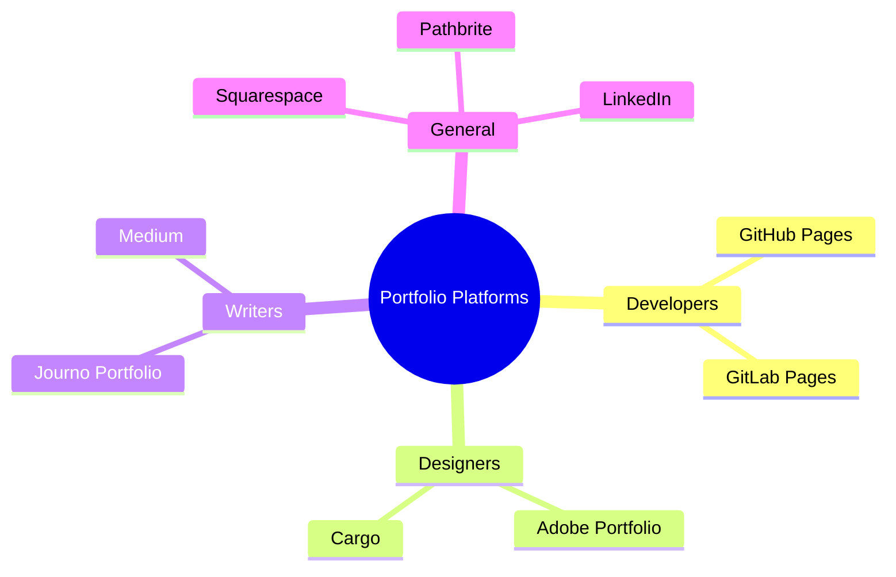

---

## WEEK 2 - M02 · Three Categories of Workplace Skills

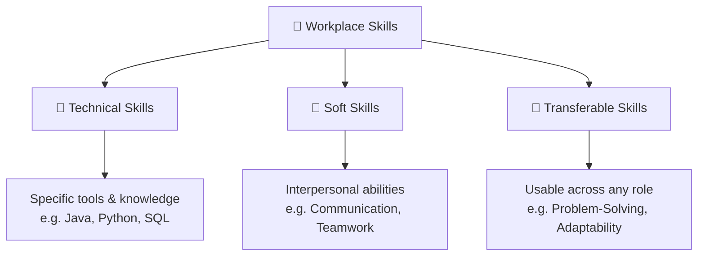

---

## WEEK 2 - M03 · Benefits of Professional Skills Mindmap

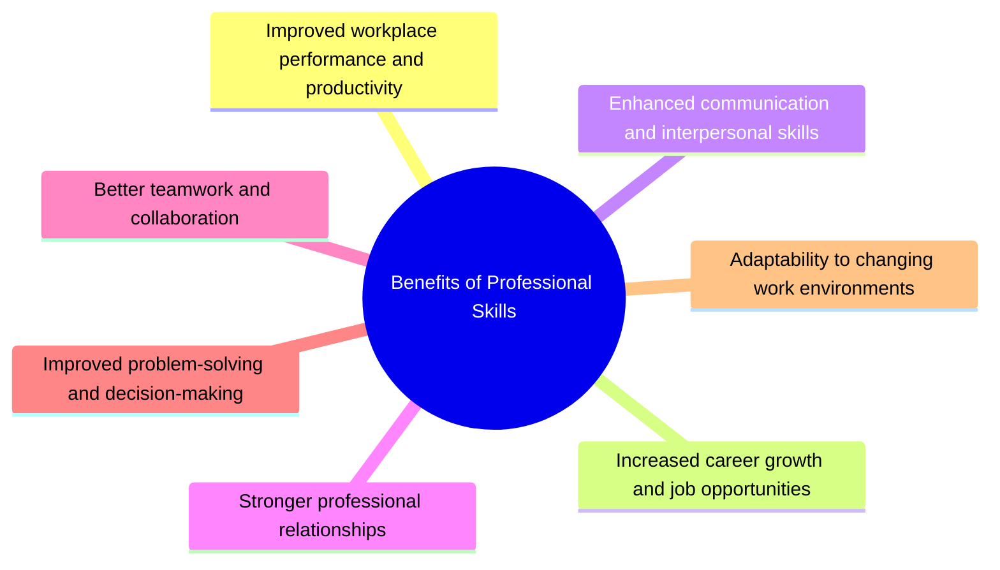

---

## WEEK 3 - M04 · Primary vs Secondary Emotions Mindmap

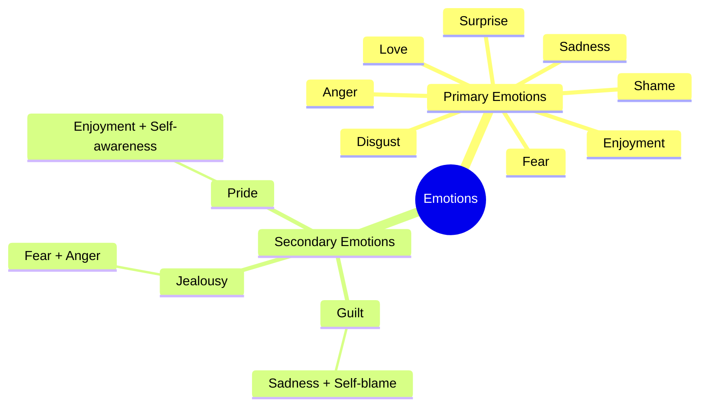

---

## WEEK 3 - M05 · Emotional Intelligence - 4 Abilities

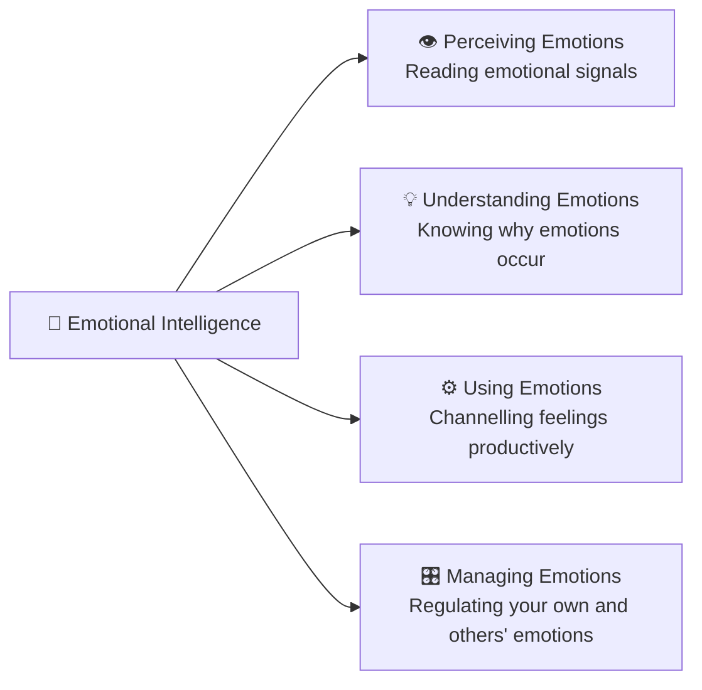

---

## WEEK 3 - M06 · Goleman's 5 EI Domains Mindmap

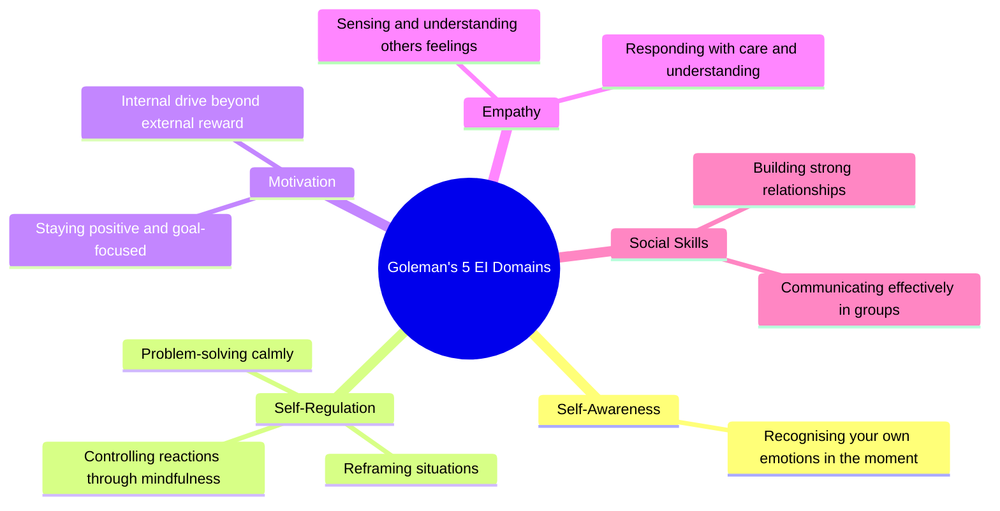

---

## WEEK 4 - M07 · Standard CV Structure Flowchart

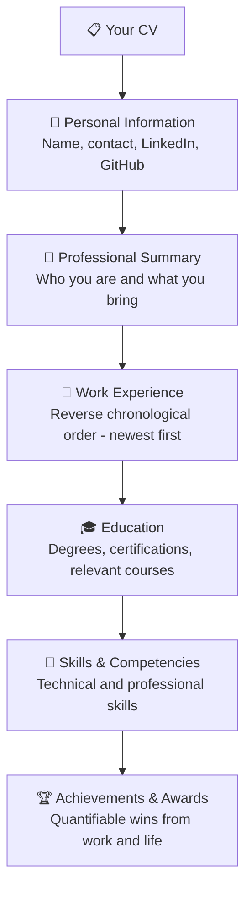

---

## WEEK 4 - M08 · ATS Pipeline Diagram

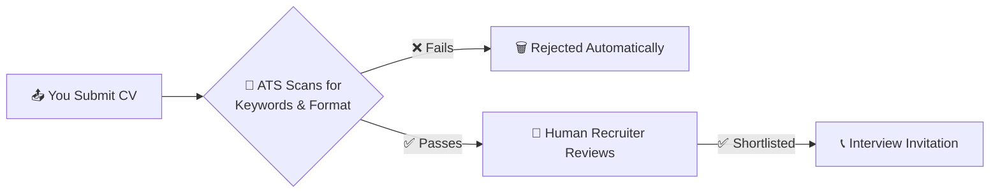

---

## WEEK 5 - M09 · Research Paper Structure Flowchart

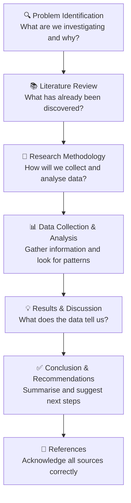

---

## WEEK 6 - M10 · Types of Agendas Mindmap

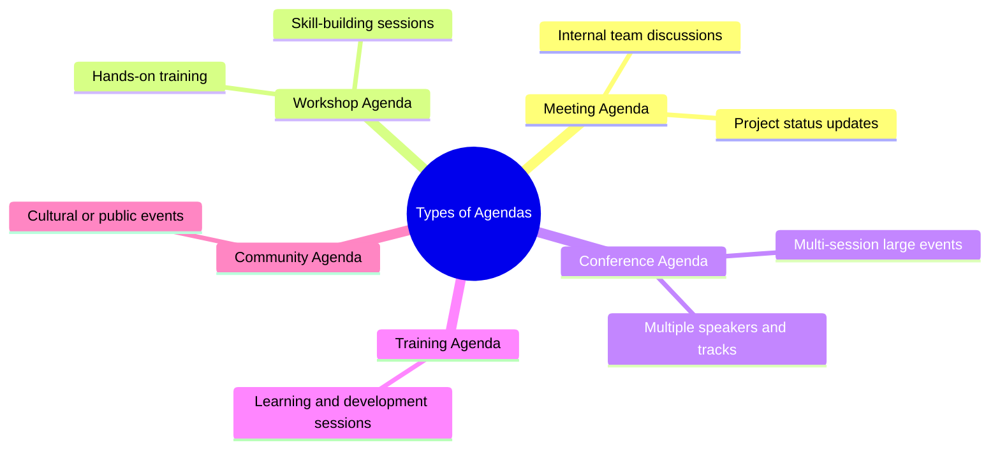

---

## WEEK 6 - M11 · Types of Meetings Graph

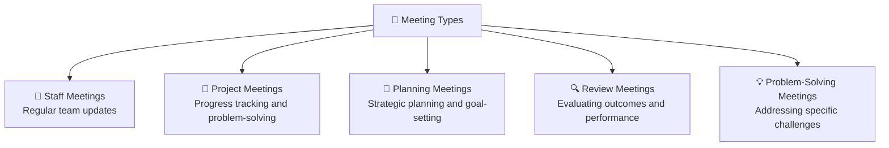

---

## WEEK 6 - M12 · 5-Step Meeting Structure Flowchart

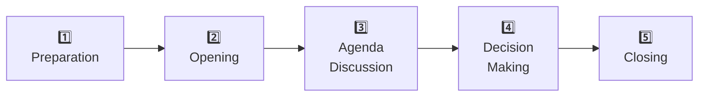

---

## WEEK 7 - M13 · Kennedy's 3 Negotiation Behaviours

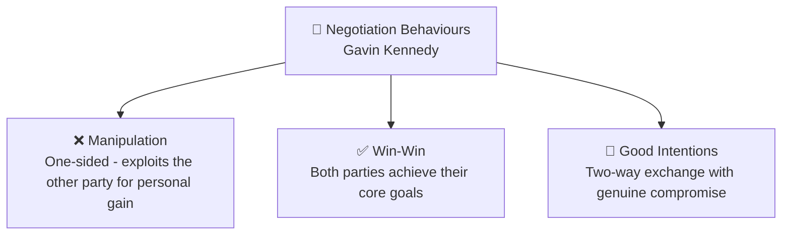

---

## WEEK 7 - M14 · 5-Step Negotiation Process Flowchart

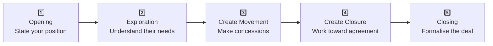

---

## WEEK 7 - M15 · Me First vs We First (Win-Lose vs Win-Win)

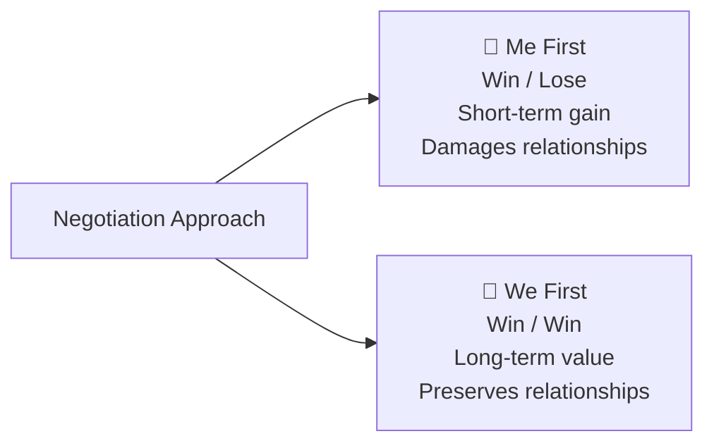

---

## WEEK 8 - M16 · Why Teamwork Matters Mindmap

```mermaid
mindmap
  root((Why Teamwork Matters))
    Synergy
      Combined output exceeds individual effort
      1+1+1 becomes more than 3
    Support
      Members back each other through difficulty
      No one is left behind
    Encouragement
      Motivation and morale from team energy
      Pushing each other to keep going
    Flexibility
      Covering each others weaknesses
      Adapting roles as needed
    Equality
      Every voice has equal weight
      Respect for all contributions
    Managing
      Good leadership keeps everything organised
      Structure enables high performance
```

---

## WEEK 8 - M17 · Tuckman's 5 Stages of Group Development

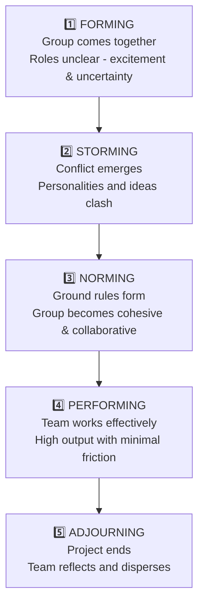

---

## WEEK 8 - M18 · Thomas Conflict Management Quadrant Chart

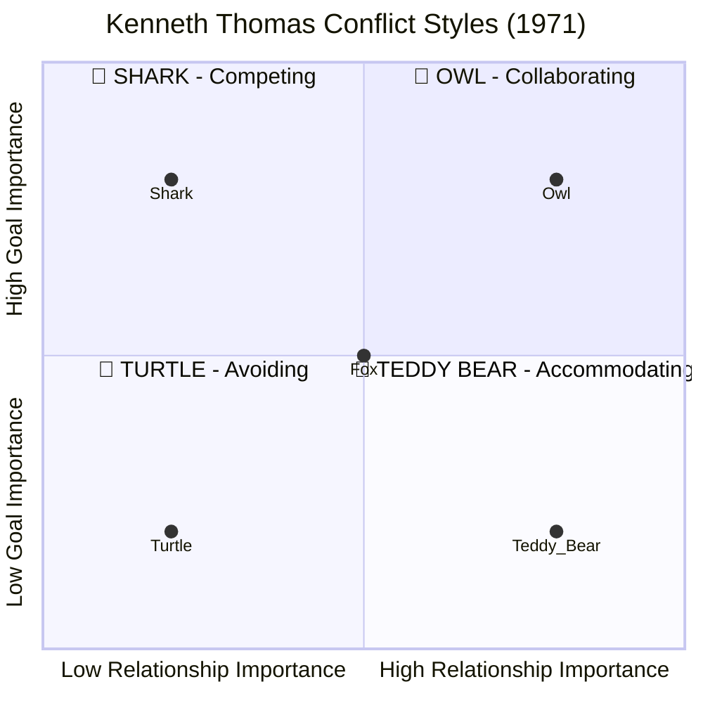

---
---

# QUICK REFERENCE TABLE

## DALL-E / ChatGPT Prompts

| # | Week | Visual Name | AR | Key Elements |
|---|------|-------------|----|----|
| 01 | Home | Harbor Cover Illustration | 16:9 | Isometric harbor, paper boats, sticky notes, polaroids, compass |
| 02 | Week 1 | Portfolio Platforms Infographic | 4:3 | 4 cork-board sticky notes by profession type |
| 03 | Week 2 | Three Skill Categories Triangle | 4:3 | Horizontal-banded triangle: Technical, Soft, Transferable |
| 04 | Week 2 | Benefits of Professional Skills Wheel | 1:1 | 7-spoke radial, brain center, alternating green/amber |
| 05 | Week 2 | Johari Window Diagram | 1:1 | 2×2 grid, 4 colors, axis labels, sticky note annotation |
| 06 | Week 3 | Primary & Secondary Emotion Wheel | 1:1 | Concentric rings, 8 inner + 3 outer segments with emoji |
| 07 | Week 3 | Goleman's 5 EI Domains Pentagon | 1:1 | Pentagon, 5 wedge segments, center EQ icon |
| 08 | Week 4 | CV Structure Vertical Flowchart | 9:16 | 6 stacked cards, green sidebar, amber step badges |
| 09 | Week 5 | 7-Step Research Process Flowchart | 9:16 | 7 stacked cards, amber number circles, IT sticky note |
| 10 | Week 6 | Types of Meetings Radial Mind Map | 4:3 | 5-spoke radial, 5 distinct colors, sticky note annotation |
| 11 | Week 7 | Negotiation Staircase + BATNA/ZOPA | 16:9 | 5-step staircase + two definition cards with Venn diagram |
| 12 | Week 8 | Why Teamwork Matters Radial Spokes | 1:1 | 6-spoke hexagonal, people-icon center, victory sticky note |
| 13 | Week 8 | Thomas Conflict Matrix 2×2 | 4:3 | 2×2 grid, 5 animals (Fox at center), axis labels |

## Mermaid Diagrams

| # | Week | Diagram Type | Name |
|---|------|-------------|------|
| M01 | Week 1 | mindmap | Portfolio Platforms |
| M02 | Week 2 | graph TD | Three Skill Categories |
| M03 | Week 2 | mindmap | Benefits of Professional Skills |
| M04 | Week 3 | mindmap | Primary vs Secondary Emotions |
| M05 | Week 3 | graph LR | EI 4 Abilities |
| M06 | Week 3 | mindmap | Goleman's 5 Domains |
| M07 | Week 4 | flowchart TD | CV Structure |
| M08 | Week 4 | flowchart LR | ATS Pipeline |
| M09 | Week 5 | flowchart TD | Research Structure |
| M10 | Week 6 | mindmap | Types of Agendas |
| M11 | Week 6 | graph TD | Types of Meetings |
| M12 | Week 6 | flowchart LR | 5-Step Meeting Structure |
| M13 | Week 7 | graph TD | Kennedy's 3 Behaviours |
| M14 | Week 7 | flowchart LR | 5-Step Negotiation Process |
| M15 | Week 7 | graph LR | Me First vs We First |
| M16 | Week 8 | mindmap | Why Teamwork Matters |
| M17 | Week 8 | flowchart TD | Tuckman's 5 Stages |
| M18 | Week 8 | quadrantChart | Thomas Conflict Model |

---

*Visual Guide by Rahul Arambepola · SA24610322 · IT1215 Professional Skills · SLIIT City Uni · June 2024 Intake*
